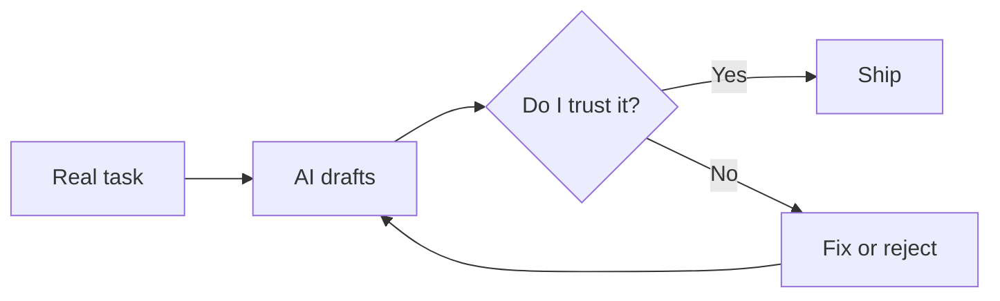

Most writing about AI is either hype or fear. This space is neither. It's a logbook of how I *actually* use AI in day-to-day engineering and product work — the workflows that stuck, the ones that wasted my time, and the judgment that decides which is which.

A few rules I hold myself to here:

- **Show the real task, not a toy demo.** Every post starts from a problem I had to solve anyway.
- **Report honestly.** If the AI got it wrong, slow, or confidently incorrect, that's the interesting part — I'll say so.
- **Keep my judgment in the loop.** The point isn't "AI did it." It's where I trusted it, where I didn't, and why.
- **Protect the work.** Like my other spaces, I write the *pattern*, not my employer's internals.

The loop I keep coming back to looks like this — AI drafts, I judge, and nothing ships without my call:

If that's useful to you, the [RSS feed](/ai/rss.xml) will carry new posts as I write them.
