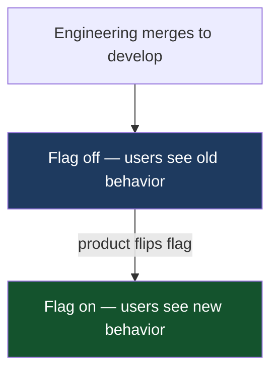

An engineer opens a PR after two weeks on a feature branch. The diff is 800 lines. Three reviewers groan. The review takes a day. Two other branches are already waiting to merge. The deploy holds its breath until someone manually checks nothing broke.

**The problem isn't that the branch got long. The problem is that the team confused "branch is merged" with "feature is released" — and let Git become the staging environment.**

| | |
|---|---|
| **Problem** | Long-lived branches are a coordination failure: they accumulate because teams conflate integration with release. Unfinished work stays in Git instead of being integrated. |
| **Why** | The instinct to protect main from incomplete work is correct. The method — keeping a long-lived branch — is wrong. It delays integration, not the release. |
| **Goal** | Integrate continuously into a single branch. Control separately when users see the feature. |

## What actually breaks

The downstream effects are predictable and compound:

**Review fatigue.** 800-line diffs get rubber-stamped. Nobody has bandwidth to reason carefully about 800 lines in a sitting. The reviewer is exhausted before they finish reading.

**Conflict debt.** Every day a branch stays open, it drifts further from what's on `develop`. When it finally merges, someone — usually the author — spends a day reconciling. The longer the branch, the longer the conflict.

**Delayed signal.** Tests that passed on the branch may not pass once it merges. The author is debugging something that broke because of another team's change from three weeks ago. They no longer have fresh context on either side.

**Coordination overhead.** "What's the merge order?" "Does your branch depend on mine?" "Let me finish the deploy before you merge." These conversations are pure overhead — the team is spending engineering time managing Git state instead of shipping.

## The actual split that matters

Trunk-based development is not a Git branching strategy. It's an organizational decision: **engineering owns integration; product owns release.**

Engineers merge continuously into a single branch (`develop`). Every merge is complete — tested, reviewed, integrated. Whether users see the feature depends on a flag, not branch state.

Product decides when to flip the flag. That decision is independent of the engineering pipeline. A feature can be merged and integrated for weeks before product decides the moment is right to expose it. Marketing can align, legal can review, support can prepare — none of that blocks the engineering team from continuing to integrate.

Without this split, every merge is a potential release — which means engineers can't merge until the feature is complete, which means branches stay long, which means the cycle continues.

## The objection that kills most trunk-based efforts

"What if the feature isn't finished?"

This objection assumes that incomplete code must stay out of `develop` to protect users. That's correct. But the protection comes from feature flags, not branch isolation.

**Feature flags solve this without the branch.** Hide unfinished work behind a flag in the code, not in Git. When the flag is off, users see the old behavior. When it's on, they see the new one. Engineers keep merging; product controls when to flip.

The common counter-objection: "That adds complexity." It does — one `if` statement per guarded feature. The branch adds complexity too: conflicts, merge coordination, review overload, delayed integration signal. The question is which complexity is easier to reason about and clean up. A flag with a clear owner is far easier to clean up than a branch that's fallen six weeks behind `develop`.

## What a manager should watch

**Branch age.** Pull a list of open PRs sorted by age. Anything older than three days without a clear reason (waiting on design review, blocked by a dependency) is a coordination signal. Ask why it hasn't merged. The answer reveals whether the team has internalized the split between integration and release.

**Review turnaround.** Large diffs are a symptom, slow reviews are a signal. If average review time is climbing, branches are probably getting longer before they're opened.

**Flag accumulation.** Feature flags have a lifecycle. Old flags that were never cleaned up fill the codebase with dead branches — literally, inside the code. A flag that was shipped and flipped on six months ago with no cleanup ticket is flag debt. Track flag creation and require cleanup as part of the feature completion definition.

**CI reliability.** Trunk-based development only functions if merging is fast and the build is trustworthy. A flaky test suite that takes 40 minutes is a blocking problem here — it's the gate every engineer hits multiple times a day. One flaky test that causes retries will generate pressure to skip CI, which collapses the entire model. CI health is infrastructure investment, not engineering vanity.

**Hotfix discipline.** Under incident pressure, teams revert to intuition. The intuition is wrong: they fix production first, then (maybe) backport. The correct order is `develop` first, verify on staging, then cherry-pick to production. If the team skips `develop`, the fix lives only in production and gets lost when the next release overwrites it. Watch for this during postmortems.

## The cultural shift

The hardest part is not the tooling — it's getting engineers to accept that merging incomplete work is not irresponsible. For most teams, "don't merge until it's done" is a deeply held norm. It feels like discipline. In a trunk-based model, it's the failure mode.

The reframe that usually lands: **merging is integration, not release.** The branch review is about correctness and safety, not about whether the feature is ready for users. Those are different conversations with different participants.

This shift often needs to be demonstrated with a single feature before it becomes practice. Pick something with clear boundaries, put it behind a flag, merge incrementally over a sprint, flip the flag when product is ready. The team sees the conflict debt disappear and the review size shrink. That experience is more persuasive than any process document.

## What I gave up

I used to cut release branches. The workflow felt structured: `release/2.4` branches off `develop` at a milestone, gets stabilized, gets deployed. Clear and auditable.

In practice it meant two codebases running in parallel. Fixes in production went into the release branch. If someone remembered, they also went into `develop`. Bugs appeared in production that had been fixed in `develop` but never backported. The release branch wasn't protecting production — it was hiding integration debt and creating a second fix surface that diverged under pressure.

Tags on `develop` do the same job — a stable, immutable artifact you can promote — without the parallel codebase. There's one source of truth. The hotfix path is explicit: fix in `develop` first, verify, cherry-pick to the tag, deploy.

## The trade-offs

| Benefit | Cost | Failure mode |
|---|---|---|
| Integration risk surfaces at merge time, not release time | Every merge must pass CI | Flaky tests slow everyone down; teams start ignoring red builds |
| Product controls release independently of engineering pipeline | Feature flags accumulate | Old flags never get cleaned up; codebase fills with dead conditions |
| Staging always reflects latest integrated code | Engineers need flag discipline | Unguarded incomplete code ships to users |
| Hotfix path is isolated from ongoing work | Fix must land in `develop` before production | Under pressure, the order reverses — fix goes to production first, `develop` never gets it |

The biggest investment isn't infrastructure. It's CI discipline and the cultural norm around small, frequent merges. Both require sustained attention from the manager, not just an initial rollout.

## One decision to make tomorrow

Find the oldest open branch in your repo. If it's been alive more than three days, ask why it hasn't merged. The answer is usually "the feature isn't finished yet."

That branch will cost someone a day of conflicts when it finally lands. Break it into the smallest piece that can safely merge. Hide the incomplete part behind a flag. Merge what's ready today.

That single habit — merge what's ready, flag what isn't — is the entire practice in miniature.

---

If you want to go deeper on the mechanics — CI pipeline, timestamp gate, feature flag discipline, and the exact hotfix cherry-pick flow — the [technical post covers the implementation](/technical/trunk-based-development/).
