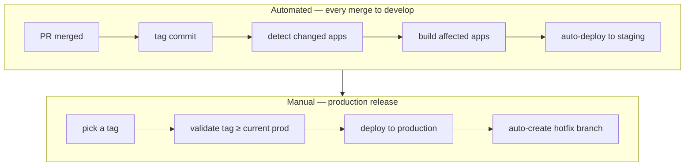
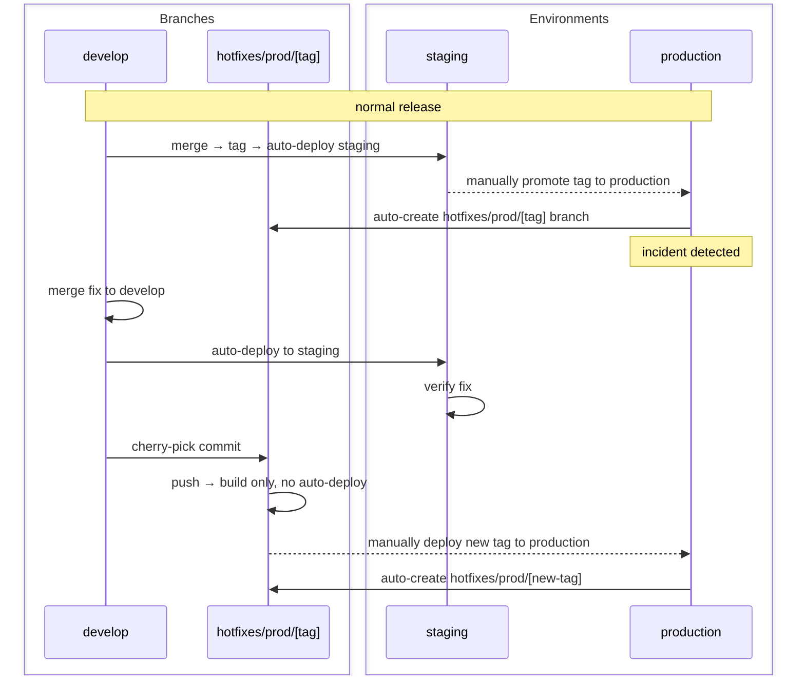

An engineer opens a PR after two weeks on a feature branch. The diff is 800 lines. Three reviewers groan: a review that takes a day, conflicts with two other branches already waiting to merge, a deploy that holds its breath until someone manually checks nothing broke. The code worked in isolation. Whether it works with everything else is unknown until it ships.

**The problem isn't that the branch got long. The problem is that integration got deferred.**

| | |
|---|---|
| **Problem** | Feature branches accumulate because teams conflate "branch is merged" with "feature is released" — so unfinished work stays in Git instead of being integrated. |
| **Why** | The instinct to protect main from incomplete work is correct. The method — keeping a long-lived branch — is wrong. It delays integration, not the release. |
| **Goal** | Integrate continuously into a single branch. Control separately when users see the feature. |

## What this unlocks

Short-lived branches mean integration risk surfaces at merge time — when the change is small and the author still has context — instead of at release time, when it's too late to do anything cleanly. Staging always reflects the latest integrated code. Production only moves when someone deliberately promotes a build. Product controls what users see without blocking engineering from shipping.

The result: smaller blast radius per merge, no coordination overhead between branches, and release decisions owned by product rather than dictated by branch state.

## The workflow

One source of truth: `develop`.

Engineers branch off `develop`, work in short-lived branches — hours, not weeks — and merge back via PR. Every merge triggers the pipeline: auto-tag the commit, detect which apps changed, build only those, deploy to staging automatically. Staging is always current with `develop`. Only what changed gets rebuilt.

Production moves only when someone deliberately picks a tag and triggers the deployment workflow. A timestamp gate rejects any tag older than what's currently running — accidental rollbacks fail before they touch infrastructure.

Nobody accumulates two weeks of private history and dumps 800 lines on their colleagues.

## The challenge: incomplete work

The objection that kills most trunk-based efforts: "What if the feature isn't finished?"

Being honest about what happens when you leave the branch alive: it falls behind `develop`. When it finally merges, there are conflicts. Tests that passed on the branch don't pass anymore. The engineer is debugging something that broke because of someone else's merge three weeks ago.

**Feature flags solve this without the branch.** Hide unfinished work behind a flag in the code, not inside Git. When the flag is off, users see the old behavior. When it's on, they see the new one. Engineers keep merging; product controls when to flip the flag.

Engineering focuses on integration. Product controls release. These are genuinely different jobs.

## Hotfixes

Every production deployment auto-creates a hotfix branch pointing at exactly the deployed commit. When an incident hits, the entry point is already there.

**The fix always starts in `develop`, not the hotfix branch.** Merge to `develop` first — the pipeline deploys to staging, the team verifies it there. Once confirmed, cherry-pick to the hotfix branch and deploy to production manually. The same timestamp gate applies.

The order that must not reverse under pressure: `develop` → verify on staging → hotfix branch → production. If the team has a preprod environment, it gets its own hotfix branch — cherry-pick to `hotfixes/preprod/[tag]` first, which auto-deploys to preprod, verify there, then cherry-pick to `hotfixes/prod/[tag]` for the manual production trigger.

This keeps `develop` authoritative. The fix exists in `develop` before it goes anywhere near production — no risk of a hotfix that lives only in production and gets lost when the next release overwrites it.

## What changed my mind

I used to cut release branches. The workflow felt structured: `release/2.4` branches off `develop` at a milestone, gets stabilized, gets deployed. Clear and auditable.

In practice it meant two codebases running in parallel. A fix in production went into `release/2.4`. If someone remembered, it also went into `develop`. Bugs appeared in production that had been fixed in `develop` but never backported. The release branch wasn't protecting production — it was hiding integration debt and spreading the fix surface across two places.

Tags on `develop` do the same job — a stable, immutable artifact you can promote to production — without the parallel codebase.

## What this costs

| Benefit | Cost | Failure mode |
|---|---|---|
| Integration risk surfaces at merge time, not release time | Every merge must pass CI | Flaky tests slow everyone down; teams start ignoring red builds |
| Staging always reflects latest `develop` | Feature flags accumulate indefinitely | Old flags are never cleaned up; codebase fills with dead branches no one removes |
| Production promotions are deliberate tag choices | Engineers need flag discipline | Unguarded incomplete code ships to users; "deploy equals release" again |
| Hotfix path is isolated from ongoing work | Fix must land in `develop` before touching production | Under pressure, the order reverses — fix goes to production first, `develop` never gets it |

The biggest investment isn't infrastructure — it's CI discipline. Trunk-based development only functions if merging to `develop` is fast and the build is trustworthy. A flaky test suite that takes 40 minutes is worse here than anywhere else, because it's the gate every engineer hits multiple times a day.

Without reliable CI, every merge is a gamble. With it, shipping becomes routine.

## One decision to make tomorrow

Find the oldest open branch in your repo. If it's been alive more than three days, ask why it hasn't merged. The answer is usually "the feature isn't finished yet." That branch will cost someone a day of conflicts when it finally lands.

Break it into the smallest piece that can safely merge. Hide the incomplete part behind a flag. Merge what's ready today.

That single habit — merge what's ready, flag what isn't — is the entire practice in miniature.
