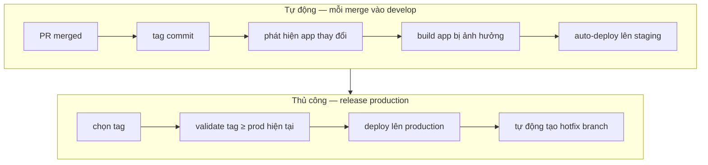
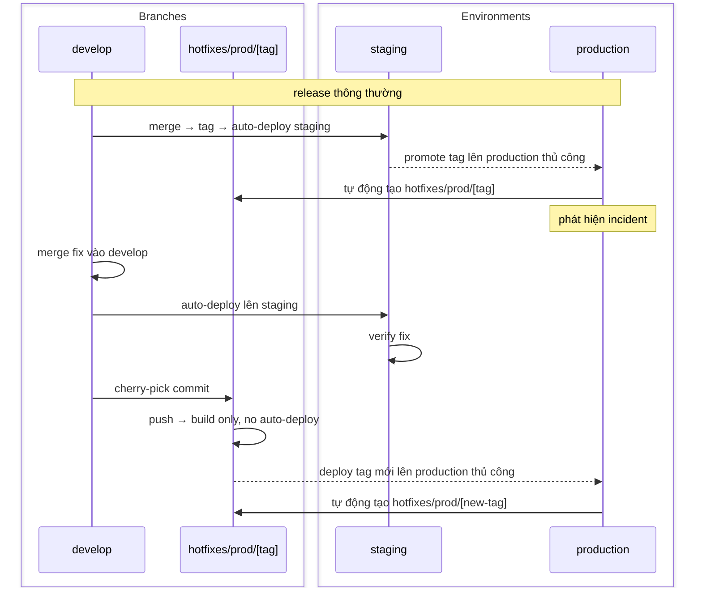

Một engineer mở PR sau hai tuần làm trên feature branch. Diff 800 dòng. Ba reviewer ngán: review mất cả ngày, conflict với hai branch khác đang chờ merge, deploy phải chờ ai đó kiểm tra thủ công trước khi chắc chắn không có gì vỡ. Code chạy đúng khi làm riêng. Có chạy đúng với phần còn lại không — chỉ biết khi ship.

**Vấn đề không phải là branch quá dài. Vấn đề là integration bị trì hoãn.**

| | |
|---|---|
| **Vấn&nbsp;đề** | Feature branch tích đống vì team đồng nhất "branch đã merge" với "feature đã release" — nên code chưa xong nằm trong Git thay vì được integrate. |
| **Tại&nbsp;sao** | Bản năng bảo vệ main khỏi code chưa hoàn thiện là đúng. Phương pháp — giữ branch sống lâu — là sai. Nó trì hoãn integration, không phải release. |
| **Mục&nbsp;tiêu** | Integrate liên tục vào một branch duy nhất. Kiểm soát riêng khi nào người dùng thấy feature. |

## Điều này mở ra gì

Branch ngắn nghĩa là rủi ro integration lộ ra ngay khi merge — lúc thay đổi còn nhỏ và tác giả vẫn còn nhớ context — thay vì khi release, khi đã quá muộn để xử lý gọn. Staging luôn phản ánh code mới nhất đã được integrate. Production chỉ thay đổi khi ai đó chủ động promote build. Product kiểm soát những gì người dùng thấy mà không cản engineering ship.

Kết quả: blast radius nhỏ hơn mỗi merge, không cần phối hợp giữa các branch, và quyết định release thuộc về product chứ không bị branch state chi phối.

## Workflow

Một source of truth duy nhất: `develop`.

Engineer tạo branch từ `develop`, làm trong branch ngắn — tính theo giờ, không phải tuần — rồi merge lại qua PR. Mỗi merge kích hoạt pipeline: tự động tag commit, phát hiện app nào thay đổi, build chỉ những app đó, deploy lên staging tự động. Staging luôn đồng bộ với `develop`. Chỉ những gì thay đổi mới được rebuild.

Production chỉ thay đổi khi ai đó chủ động chọn tag và kích hoạt deployment workflow. Timestamp gate reject bất kỳ tag nào cũ hơn version đang chạy — rollback vô ý thất bại trước khi chạm tới infrastructure.

Không ai tích lũy hai tuần code riêng rồi đổ 800 dòng lên đồng nghiệp.

## Thách thức: code chưa xong

Objection thường giết chết trunk-based: "Nếu feature chưa xong thì sao?"

Thực tế khi giữ branch sống: nó tụt lại sau `develop`. Khi cuối cùng merge, có conflict. Test vốn pass trên branch giờ không pass nữa. Engineer phải debug thứ gì đó vỡ vì merge của người khác ba tuần trước.

**Feature flag giải quyết vấn đề này mà không cần branch.** Giấu code chưa xong sau flag trong code, không phải trong Git. Khi flag tắt, người dùng thấy behavior cũ. Khi bật, họ thấy behavior mới. Engineer tiếp tục merge; product kiểm soát khi nào bật flag.

Engineering tập trung vào integration. Product kiểm soát release. Đây thực sự là hai công việc khác nhau.

## Hotfix

Mỗi lần deploy production tự động tạo hotfix branch trỏ đúng vào commit đã deploy. Khi incident xảy ra, điểm vào đã sẵn sàng.

**Fix luôn bắt đầu từ `develop`, không phải hotfix branch.** Merge vào `develop` trước — pipeline deploy lên staging, team verify ở đó. Sau khi xác nhận, cherry-pick vào hotfix branch và deploy production thủ công. Timestamp gate vẫn áp dụng.

Thứ tự không được đảo ngược dù áp lực lớn đến đâu: `develop` → verify trên staging → hotfix branch → production. Nếu team có môi trường preprod, nó có hotfix branch riêng — cherry-pick vào `hotfixes/preprod/[tag]` trước, auto-deploy lên preprod, verify ở đó, rồi cherry-pick vào `hotfixes/prod/[tag]` để trigger production thủ công.

`develop` vẫn là nguồn chính xác. Fix tồn tại trong `develop` trước khi đến production — không có rủi ro hotfix chỉ sống trong production rồi bị mất khi release tiếp theo ghi đè.

## Điều thay đổi suy nghĩ của tôi

Trước đây tôi dùng release branch. Workflow trông có cấu trúc: `release/2.4` tách từ `develop` tại một milestone, được stabilize, rồi deploy. Rõ ràng và dễ audit.

Thực tế là hai codebase chạy song song. Fix trên production vào `release/2.4`. Nếu ai đó nhớ, nó cũng vào `develop`. Bug xuất hiện trên production vốn đã được fix trong `develop` nhưng không bao giờ backport. Release branch không bảo vệ production — nó che giấu integration debt và phân tán fix ra hai chỗ.

Tag trên `develop` làm cùng việc đó — artifact ổn định, bất biến để promote lên production — mà không cần codebase song song.

## Chi phí

| Lợi ích | Chi phí | Failure mode |
|---|---|---|
| Rủi ro integration lộ khi merge, không phải release | Mỗi merge phải pass CI | Test flaky làm chậm mọi người; team bắt đầu bỏ qua build đỏ |
| Staging luôn phản ánh `develop` mới nhất | Feature flag tích lũy vô thời hạn | Flag cũ không bao giờ được dọn; codebase đầy code chết không ai xóa |
| Promote production là lựa chọn tag có chủ đích | Engineer cần kỷ luật với flag | Code chưa xong ship tới người dùng; "deploy bằng release" trở lại |
| Đường hotfix tách biệt khỏi công việc đang làm | Fix phải vào `develop` trước khi chạm production | Dưới áp lực, thứ tự đảo ngược — fix vào production trước, `develop` không bao giờ có |

Đầu tư lớn nhất không phải infrastructure — mà là kỷ luật CI. Trunk-based development chỉ hoạt động nếu merge vào `develop` nhanh và build đáng tin. Test suite flaky chạy 40 phút tệ hơn bất cứ đâu khác ở đây, vì nó là cổng mỗi engineer phải đi qua nhiều lần mỗi ngày.

Không có CI đáng tin, mỗi merge là canh bạc. Có CI tốt, ship trở thành việc thường ngày.

## Một quyết định cho ngày mai

Tìm branch cũ nhất đang mở trong repo. Nếu nó tồn tại hơn ba ngày, hỏi tại sao chưa merge. Câu trả lời thường là "feature chưa xong". Branch đó sẽ tốn của ai đó một ngày giải quyết conflict khi cuối cùng được merge.

Chia nó thành phần nhỏ nhất có thể merge an toàn. Giấu phần chưa xong sau flag. Merge những gì đã sẵn sàng ngay hôm nay.

Một thói quen đó — merge những gì sẵn sàng, flag những gì chưa xong — là toàn bộ quy trình ở dạng thu nhỏ.
