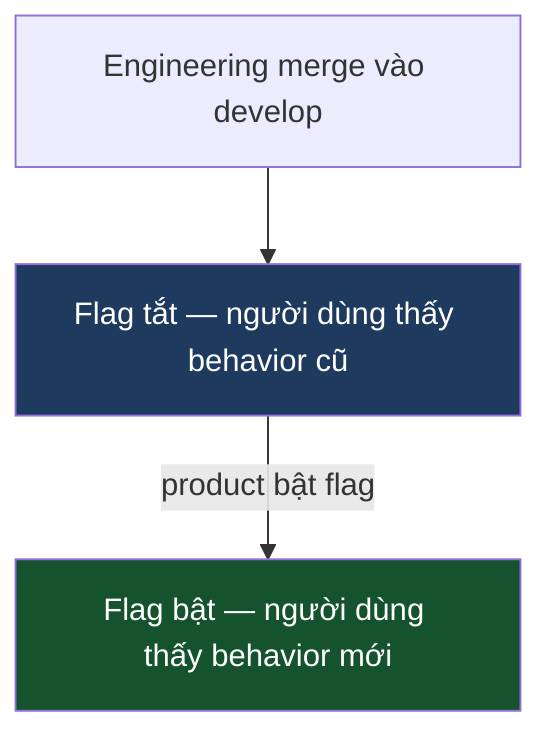

Engineer mở PR sau hai tuần làm trên feature branch. Diff 800 dòng. Ba reviewer ngán. Review mất cả ngày. Hai branch khác đang chờ merge. Deploy nín thở cho đến khi ai đó kiểm tra thủ công xong.

**Vấn đề không phải là branch quá dài. Vấn đề là team nhầm "branch đã merge" với "feature đã release" — và để Git trở thành staging environment.**

| | |
|---|---|
| **Vấn đề** | Branch sống lâu là failure phối hợp: tích đống vì team đồng nhất integration với release. Code chưa xong nằm trong Git thay vì được integrate. |
| **Tại sao** | Bản năng bảo vệ main khỏi code chưa hoàn thiện là đúng. Phương pháp — giữ branch sống lâu — là sai. Nó trì hoãn integration, không phải release. |
| **Mục tiêu** | Integrate liên tục vào một branch duy nhất. Kiểm soát riêng khi nào người dùng thấy feature. |

## Thực tế vỡ ra như thế nào

Hậu quả có thể đoán trước và cộng hưởng với nhau:

**Review fatigue.** Diff 800 dòng bị rubber-stamp. Không ai có bandwidth để đọc kỹ 800 dòng trong một lần ngồi. Reviewer kiệt sức trước khi đọc xong.

**Conflict debt.** Mỗi ngày branch mở, nó tụt lại xa hơn `develop`. Khi cuối cùng merge, ai đó — thường là tác giả — mất cả ngày hòa giải. Branch càng dài, conflict càng nhiều.

**Mất tín hiệu.** Test pass trên branch có thể không pass sau khi merge. Tác giả phải debug thứ gì đó vỡ vì merge của team khác từ ba tuần trước, lúc đó context đã mất hết.

**Overhead phối hợp.** "Thứ tự merge là gì?" "Branch của bạn phụ thuộc vào branch của tôi không?" "Để tôi deploy xong rồi bạn mới merge." Những cuộc trò chuyện này là overhead thuần túy — team đang dùng thời gian engineering để quản lý Git state thay vì ship.

## Sự tách biệt thực sự quan trọng

Trunk-based development không phải là chiến lược branching Git. Đây là quyết định tổ chức: **engineering sở hữu integration; product sở hữu release.**

Engineer merge liên tục vào `develop`. Mỗi merge hoàn chỉnh — đã test, đã review, đã integrate. Người dùng có thấy feature hay không phụ thuộc vào flag, không phải branch state.

Product quyết định khi nào bật flag. Quyết định đó độc lập với engineering pipeline. Feature có thể được merge và integrate nhiều tuần trước khi product thấy thời điểm phù hợp. Marketing chuẩn bị, legal review, support chuẩn bị — không cái nào block engineering tiếp tục integrate.

Không có sự tách biệt này, mỗi merge là release tiềm năng — nghĩa là engineer không thể merge cho đến khi feature hoàn thiện, branch tiếp tục sống dài, và vòng lặp tiếp tục.

## Objection thường giết chết trunk-based

"Nếu feature chưa xong thì sao?"

Objection này giả định code chưa hoàn thiện phải nằm ngoài `develop` để bảo vệ người dùng. Đúng. Nhưng sự bảo vệ đến từ feature flag, không phải branch isolation.

**Feature flag giải quyết vấn đề này mà không cần branch.** Giấu code chưa xong sau flag trong code, không phải trong Git. Khi flag tắt, người dùng thấy behavior cũ. Khi bật, họ thấy behavior mới. Engineer tiếp tục merge; product kiểm soát khi nào bật.

Counter-objection thường gặp: "Phức tạp hơn." Đúng — một câu `if` mỗi feature được guard. Branch cũng phức tạp: conflict, phối hợp merge, review overload, tín hiệu integration bị trễ. Câu hỏi là loại phức tạp nào dễ lý luận và dọn dẹp hơn. Flag với owner rõ ràng dễ dọn hơn nhiều so với branch đã tụt lại sáu tuần sau `develop`.

## Manager cần theo dõi gì

**Branch age.** Lấy danh sách PR đang mở, sort theo tuổi. Cái nào cũ hơn ba ngày mà không có lý do rõ ràng là tín hiệu phối hợp. Hỏi tại sao chưa merge. Câu trả lời cho thấy team đã internalize sự tách biệt integration/release hay chưa.

**Review turnaround.** Diff lớn là triệu chứng; review chậm là tín hiệu. Nếu thời gian review trung bình tăng, branch có thể đang dài hơn trước khi được mở.

**Flag accumulation.** Feature flag có vòng đời. Flag cũ không được dọn lấp đầy codebase bằng code chết — theo nghĩa đen, bên trong code. Flag đã ship và đã bật 100% từ sáu tháng trước mà không có cleanup ticket là flag debt. Theo dõi số lượng flag và yêu cầu cleanup là một phần của định nghĩa "feature hoàn thành".

**CI reliability.** Trunk-based development chỉ hoạt động nếu merge nhanh và build đáng tin. Test suite flaky chạy 40 phút là vấn đề blocking — đây là cổng mỗi engineer phải đi qua nhiều lần mỗi ngày. Một test flaky khiến phải retry sẽ tạo áp lực để skip CI, và khi đó toàn bộ model sụp đổ. CI health là đầu tư infrastructure, không phải vanity của engineering.

**Hotfix discipline.** Dưới áp lực incident, team quay về bản năng. Bản năng sai: fix production trước, rồi (có thể) backport. Thứ tự đúng là `develop` trước, verify trên staging, rồi cherry-pick lên production. Nếu team skip `develop`, fix chỉ tồn tại trong production và mất khi release tiếp theo ghi đè. Theo dõi điều này trong postmortem.

## Thay đổi văn hóa

Phần khó nhất không phải tooling — mà là thuyết phục engineer rằng merge code chưa hoàn thiện không phải là thiếu trách nhiệm. Với hầu hết team, "đừng merge cho đến khi xong" là norm ăn sâu. Có vẻ như kỷ luật. Trong model trunk-based, đó chính là failure mode.

Cách reframe thường hoạt động: **merge là integration, không phải release.** Review PR là về correctness và safety, không phải về việc feature đã sẵn sàng cho người dùng chưa. Đó là hai cuộc trò chuyện khác nhau với người tham gia khác nhau.

Sự thay đổi này thường cần được chứng minh với một feature duy nhất trước khi trở thành thực hành. Chọn thứ gì đó có ranh giới rõ ràng, đặt sau flag, merge tăng dần trong một sprint, bật flag khi product sẵn sàng. Team thấy conflict debt biến mất và review size thu nhỏ. Trải nghiệm đó thuyết phục hơn bất kỳ tài liệu quy trình nào.

## Điều tôi từ bỏ

Trước đây tôi dùng release branch. Workflow trông có cấu trúc: `release/2.4` tách từ `develop` tại milestone, được stabilize, được deploy. Rõ ràng và dễ audit.

Thực tế là hai codebase chạy song song. Fix trên production vào release branch. Nếu ai đó nhớ, nó cũng vào `develop`. Bug xuất hiện trên production vốn đã được fix trong `develop` nhưng không bao giờ backport. Release branch không bảo vệ production — nó che giấu integration debt và tạo hai fix surface phân kỳ dưới áp lực.

Tag trên `develop` làm cùng việc — artifact ổn định, bất biến để promote — mà không cần codebase song song. Một source of truth. Đường hotfix rõ ràng: fix trong `develop` trước, verify, cherry-pick vào tag, deploy.

## Trade-off

| Lợi ích | Chi phí | Failure mode |
|---|---|---|
| Rủi ro integration lộ khi merge, không phải release | Mỗi merge phải pass CI | Test flaky làm chậm mọi người; team bỏ qua build đỏ |
| Product kiểm soát release độc lập với engineering pipeline | Feature flag tích lũy | Flag cũ không được dọn; codebase đầy điều kiện chết |
| Staging luôn phản ánh code mới nhất đã integrate | Engineer cần kỷ luật với flag | Code chưa xong ship tới người dùng |
| Đường hotfix tách biệt khỏi công việc đang làm | Fix phải vào `develop` trước production | Dưới áp lực, thứ tự đảo ngược — fix vào production trước, `develop` không bao giờ có |

Đầu tư lớn nhất không phải infrastructure. Là kỷ luật CI và norm về merge nhỏ, thường xuyên. Cả hai cần sự chú ý liên tục từ manager, không chỉ một lần rollout ban đầu.

## Một quyết định cho ngày mai

Tìm branch cũ nhất đang mở trong repo. Nếu nó tồn tại hơn ba ngày, hỏi tại sao chưa merge. Câu trả lời thường là "feature chưa xong".

Branch đó sẽ tốn của ai đó một ngày giải quyết conflict khi cuối cùng merge. Chia nó thành phần nhỏ nhất có thể merge an toàn. Giấu phần chưa xong sau flag. Merge những gì sẵn sàng ngay hôm nay.

Một thói quen đó — merge những gì sẵn sàng, flag những gì chưa xong — là toàn bộ quy trình ở dạng thu nhỏ.

---

Nếu muốn đi sâu hơn vào cơ chế — CI pipeline, timestamp gate, kỷ luật feature flag, và hotfix cherry-pick flow — [bài kỹ thuật có phần implementation](/technical/trunk-based-development/).
