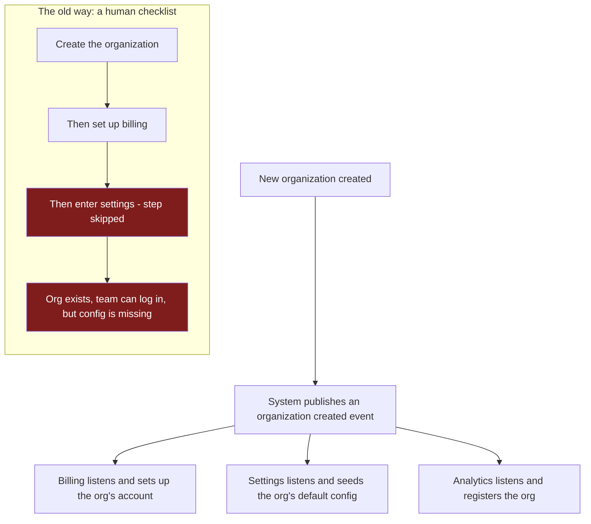

A company signs up, a new organization is created, and the team logs in. The next morning, support gets a ticket: people can sign in, but there's no billing account, no plan, no default settings. The org clearly exists — that's how they logged in. Its data and config were never set up everywhere else. Somewhere, a step got missed.

**Creating an organization should set up all of its data and config automatically, across every system — with no human running a checklist that can miss a step.**

This is part 2 of the series. Part 1 introduced the five pieces; this part is the first one: the organization, and what should happen the moment a new org is created.

| | |
|---|---|
| **Problem** | Creating an org means setting it up in many systems — billing, settings, analytics. Whoever runs that checklist can miss a step, and the org is left half-created. |
| **Why** | The setup isn't automatic. It depends on a person, or on code calling each system in turn, and any one call can fail silently. |
| **Goal** | One action creates the org and provisions all its data and config automatically. No human checklist, nothing to miss. |

## Why it matters

A half-created org is the worst kind of bug, because nothing looks broken — no error, no alert, the team can log in. The missing data or config surfaces later, at the first invoice or report, when no one remembers the setup that quietly skipped a step. Every one is a manual investigation: which systems have this org's data, which don't, and what has to be created by hand to fix it. And it compounds — every new system that holds per-org data is one more thing a person has to remember to set up.

## Create the data automatically

**The moment an org is created, every system that needs its data sets it up on its own — no one calls them, no one ticks a box.**

Here's how it works. When a new org is created, the system publishes a single event — an "organization created" notification, the same idea as a webhook. Every other system subscribes to that event: billing, settings, analytics, anything else. When it fires, each one provisions its own piece for the new org. The org's creation doesn't know or care who is listening — it just announces the fact once, and the listeners do the rest.

There's no checklist for a person to run and no step for them to forget, so an org is never missing from a system because someone skipped a line. A system that's briefly down simply picks up the event when it recovers.

**Benefit:** Every system has the org's data, every time. The human can't miss a step because there's no step to miss.

## Set the config automatically

**A new org gets its default config seeded for it — currency, plan, formats, limits — without anyone entering it by hand.**

Defaults entered manually are where typos and inconsistencies creep in: one org set up slightly differently from the rest, behaving wrong in a way no one notices until a customer does. When creation seeds config automatically, every org starts from the same correct baseline. Anything genuinely org-specific is changed deliberately afterward, not reconstructed from memory at signup.

**Benefit:** Every org starts configured correctly and consistently. No hand-entry, no drift, no quiet typo in a setting.

## How it looks end to end

## The trade-off

| | Manual or step-by-step setup | One action, set up automatically |
|---|---|---|
| Missing data | A skipped step leaves an org half-created | Every system provisions its own piece |
| Config | Hand-entered, prone to typos and drift | Seeded from one correct baseline |
| Human error | Always possible, surfaces late | No step to miss |
| Cost | Simple at first, breaks as systems grow | Automation built once |

It isn't free: the automatic setup has to be built once, and for a few seconds after creation the org exists before every system has caught up — so don't design the first-run experience to assume everything is ready instantly. But manual setup only looks simpler. It just moves the cost onto a person who will eventually miss a step, and onto support tickets when they do. You pay either way; the choice is whether you pay once, in automation, or forever in missed setups.

## What's next

Part 3 moves from the org to the person inside it: how one human can be an admin in their own org and a read-only guest in a partner's, with one consistent answer to what they're allowed to do.
