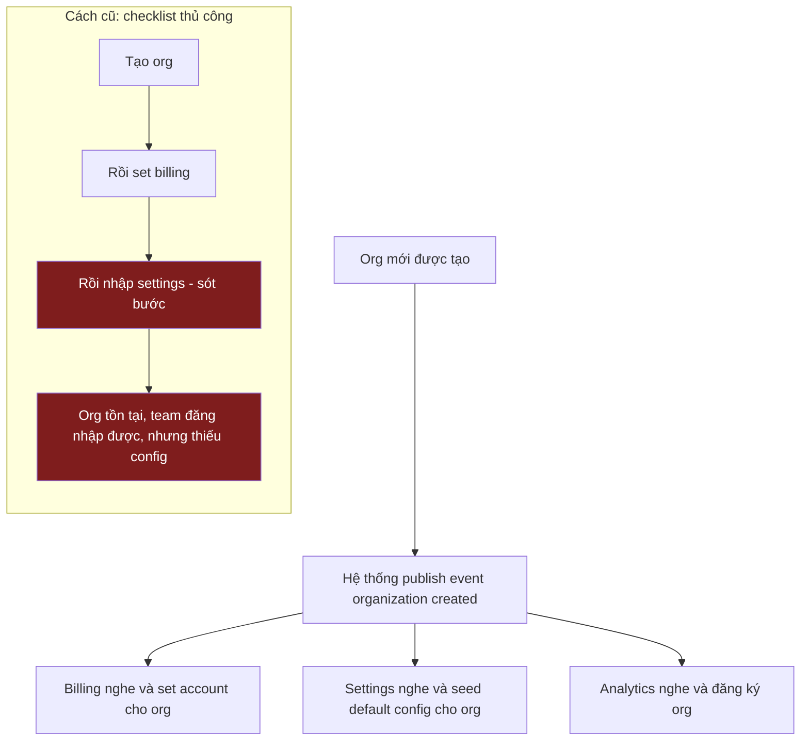

Công ty đăng ký, org mới được tạo, team đăng nhập. Sáng hôm sau support nhận ticket: đăng nhập được, nhưng không có billing account, không plan, không default settings. Org rõ ràng tồn tại — đăng nhập được là nhờ vậy. Nhưng data và config của nó chưa được set ở những chỗ còn lại. Sót một bước.

**Tạo org nên tự động set toàn bộ data và config trên mọi hệ thống — không cần ai chạy checklist rồi sót bước.**

Đây là phần 2 của series. Phần 1 giới thiệu năm thành phần; phần này nói về thành phần đầu tiên: organization, và điều cần xảy ra ngay khi org mới ra đời.

| | |
|---|---|
| **Vấn đề** | Tạo org là phải set nó trong nhiều hệ thống — billing, settings, analytics. Sót một bước là org dở dang. |
| **Nguyên nhân** | Việc set không tự động. Nó dựa vào con người, hoặc code gọi lần lượt từng hệ thống, mà call nào cũng có thể hỏng mà không báo gì. |
| **Mục tiêu** | Một thao tác tạo org và tự set toàn bộ data, config. Không checklist, không gì để sót. |

## Vì sao quan trọng

Org dở dang là bug khó thấy nhất: không lỗi, không alert, team vẫn đăng nhập được. Data hay config thiếu chỉ lộ ra ở hóa đơn hay report đầu tiên, khi chẳng ai còn nhớ lần set đã sót bước. Mỗi lần là một lần điều tra tay: hệ thống nào có data của org, hệ thống nào không, phải tạo tay gì để vá. Càng tệ khi dồn lại — thêm hệ thống giữ data theo org là thêm thứ phải nhớ set.

## Tự động tạo data

**Org vừa tạo xong, mọi hệ thống cần data của nó tự lo phần mình — không ai gọi, không ai tick ô.**

Org tạo xong, hệ thống publish đúng một event "organization created", giống webhook. Các hệ thống còn lại subscribe event đó: billing, settings, analytics, gì cũng được. Event bắn ra, mỗi hệ thống tự set phần của mình. Bên tạo org không cần biết ai đang nghe — báo một lần, phần còn lại để listener lo.

Không checklist để chạy, không bước để quên, nên org không bao giờ thiếu khỏi hệ thống vì sót một dòng. Hệ thống đang down thì nhận lại event khi sống lại.

**Được gì:** Hệ thống nào cũng có data của org, mọi lần. Không thể sót bước vì chẳng có bước nào để sót.

## Tự động set config

**Org mới được seed sẵn default config — currency, plan, formats, limits — không ai gõ tay.**

Gõ tay là chỗ typo và sai lệch chui vào: org set lệch phần còn lại, chạy sai mà không ai thấy cho tới khi khách hàng thấy. Seed config tự động lúc tạo org thì mọi org xuất phát từ cùng baseline đúng. Cái gì thật sự riêng của org thì sửa sau, có chủ đích, không dựng lại theo trí nhớ lúc đăng ký.

**Được gì:** Org nào cũng khởi đầu với config đúng, nhất quán. Không gõ tay, không drift, không typo âm thầm.

## Toàn cảnh từ đầu đến cuối

## Đánh đổi

| | Set thủ công, tuần tự | Một thao tác, tự động |
|---|---|---|
| Thiếu data | Sót bước là org dở dang | Mỗi hệ thống tự lo phần mình |
| Config | Gõ tay, dễ typo và drift | Seed từ một baseline đúng |
| Lỗi con người | Luôn có thể, lộ ra muộn | Không có bước để sót |
| Chi phí | Đầu dễ, vỡ khi hệ thống tăng | Tự động hóa, xây một lần |

Không miễn phí: phần tự động phải xây một lần, và vài giây sau khi tạo org đã tồn tại trước khi mọi hệ thống bắt kịp — nên đừng giả định mọi thứ sẵn sàng ngay ở lần đầu. Nhưng set thủ công chỉ trông đơn giản hơn. Nó đẩy chi phí sang một người rồi sẽ sót bước, và sang support ticket khi điều đó xảy ra. Kiểu nào bạn cũng trả: trả một lần cho tự động hóa, hay trả mãi cho những lần sót.

## Phần tiếp theo

Phần 3 chuyển từ org sang con người bên trong: làm sao một người vừa là admin trong org của mình, vừa là guest read-only trong org của đối tác, với một câu trả lời nhất quán cho việc họ được làm gì.
