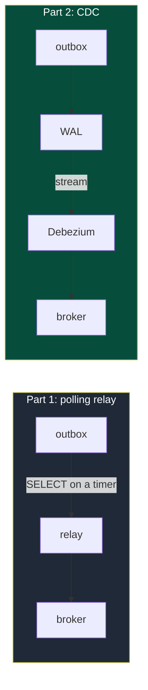
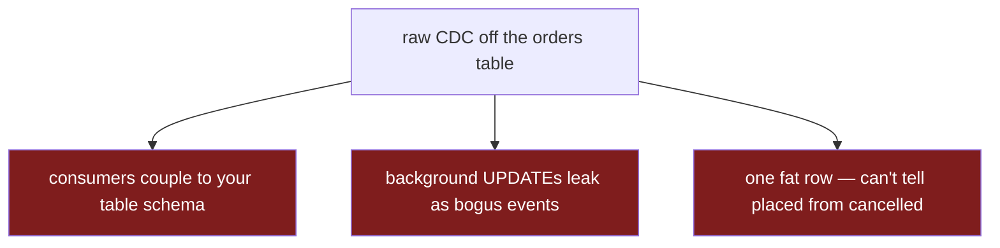
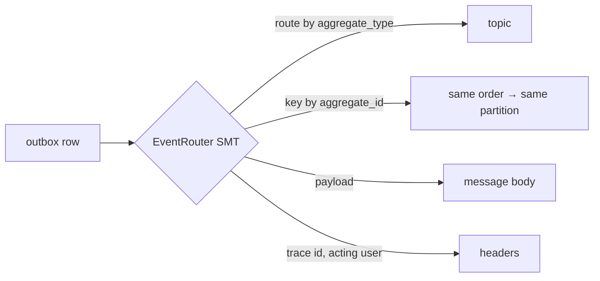

> **Part 2 of 2.** [Part 1](/technical/the-dual-write-problem/) built an outbox with a polling relay. Now we delete the relay.

The polling relay from Part 1 works, but it has a smell I couldn't unsmell. I'm asking the database "anything new?" on a timer — when the database already knew the answer the instant the row committed. Every commit is appended to the **write-ahead log**: an ordered, durable record of every change, the same log Postgres uses for replication and crash recovery. My relay was re-deriving, slower and more crudely, a log the database already maintains perfectly.

| | |
|---|---|
| **Problem** | The Part 1 outbox needs a polling relay — a process to write, run, and watch. |
| **Why** | Polling re-derives, on a timer, a log Postgres *already* keeps perfectly: the write-ahead log (WAL). |
| **Goal** | Publish straight from the WAL and delete the relay — without leaking our table schema to consumers. |



Change-data-capture taps that log directly. Debezium connects as a logical replication client — the same interface a Postgres read-replica uses — reads the WAL, and emits a message for every committed change. No polling loop, no relay process, and the latency collapses from "poll interval" to "however fast the WAL streams," which is effectively real time.

## Don't point CDC at your business tables

The tempting move is to delete the outbox table entirely. Why keep it? Just stream changes off the `orders` table directly — the row change *is* the event. This is the same category of mistake as Part 1's "publish inside the transaction": it conflates two things that look alike and aren't.



Raw CDC off a business table is honest to a fault — it publishes whatever happened to the row, with no notion of what you *meant*:

- **Schema coupling.** Every consumer now depends on your physical table layout. Rename a column, split a table, add a NOT NULL, and you've broken every downstream service at once. Your storage schema was never designed to be a public API, and the moment it becomes one you can't refactor it.
- **Events you never meant to emit.** A nightly job that touches `updated_at`, a data backfill, a manual fix in psql — all of it streams out as "events." Consumers can't tell a real state change from an incidental write.
- **No control over shape or meaning.** One `orders` row becomes one fat change record with before/after images. But "order placed" and "order cancelled" are different events, with different consumers and different payloads. A raw row can't tell them apart.

The lesson: **CDC gives you a reliable transport, but a transport is not a contract.** I still want to decide, explicitly and by hand, what counts as a domain event and what shape it has. So the outbox table stays — it was never the part I wanted gone. The *relay* was.

## Keep the outbox, stream it with the EventRouter

The outbox table stays, with columns chosen so a change-capture tool can route and shape each row into a clean event:

```sql
CREATE TABLE outbox_events (
  id             BIGINT GENERATED ALWAYS AS IDENTITY PRIMARY KEY,
  aggregate_type TEXT NOT NULL,  -- "orders"       → routes to a topic
  aggregate_id   TEXT NOT NULL,  -- "ord_123"      → becomes the message key
  event_type     TEXT NOT NULL,  -- "order.placed"
  payload        JSONB NOT NULL,
  created_at     TIMESTAMPTZ NOT NULL DEFAULT now()
);
```

The write path is identical to Part 1: one transaction, two inserts. Only the *reader* changes. Instead of my relay, a Debezium connector reads the WAL and runs the **outbox EventRouter** — a built-in transform that knows this table is an outbox, not a business table, and turns each inserted row into a properly addressed message.



This does what my relay did, and more, declaratively. It routes each row to a topic by `aggregate_type`, sets the message key from `aggregate_id` so every event for one order lands on the same partition (which is how you preserve per-order ordering in Kafka), and ships `payload` as the body. Crucially, **only inserts into *this* table become events** — so the schema-coupling and accidental-event problems from the naive approach are gone by construction. Consumers see the payload I deliberately shaped, never my physical schema.

One detail worth stealing: route request-context fields — trace IDs, the acting user — into message **headers** rather than the payload body. That lets a consumer stitch a distributed trace across the async hop without those operational fields leaking into the domain event's contract. Keep the event about the domain; keep the plumbing in the headers.

## The trade-off

CDC deletes the relay, but it does not delete cost — it swaps a problem I fully understood for a few I had to learn the hard way. This is the section I wish someone had shown me first.

| Cost | What bites you |
|---|---|
| **Replication slot = disk risk** | Debezium down → Postgres retains WAL → disk fills → **the whole DB goes down** |
| **Low-traffic DBs stall the slot** | Slot only advances as the WAL moves; a quiet DB pins it for hours |
| **`snapshot.mode: never`** | No backfill on first start — misconfigure it and you silently skip events |
| **You now run Kafka Connect** | A cluster, a connector, a slot + publication to provision, a new dashboard |
| **Still at-least-once** | Re-delivers after a restart → consumers **must stay idempotent** (same as Part 1) |

**The replication slot is a loaded gun pointed at your database.** A logical slot makes Postgres *retain WAL* until the consumer confirms it has read past that point. If Debezium goes down — a crash, a bad deploy, a network partition — the slot stops advancing and Postgres dutifully keeps every WAL segment since. On a busy database that fills the disk and takes down the *entire database*, not just your event pipeline. The hand-written relay could never hurt the database like this; the worst it could do was fall behind. This single shift in blast radius is the biggest reason CDC is not a free upgrade, and slot-lag monitoring is not optional — it's day-one work.

**Quiet databases make it paradoxically worse.** The slot only advances when the WAL moves, so a database that rarely writes can leave the slot pinned to an old position for hours, silently accumulating retained WAL. The fix is a **heartbeat**: have Debezium periodically write a tiny row to a dedicated table, which generates WAL, which lets the slot advance. You end up adding writes for the sole purpose of keeping the log moving — deeply counterintuitive until the first disk-fill incident teaches you why it's there.

**`snapshot.mode: never` means there is no safety net on cold start.** I configure the connector *not* to snapshot the table when it first starts — it begins from the current WAL position. That's correct for an outbox, where old rows are already published. But it also means a slot created too late, or a connector pointed at the wrong position, will silently skip events with no error to tell you. Provisioning the publication and slot *before* the first write is part of the design, not an afterthought.

**And you are now operating Kafka Connect.** The relay was a few lines inside a service I already ran. Debezium is a Connect cluster to keep alive, a connector to register and version, a slot and publication to provision (I do this in Terraform so it never becomes click-ops), and a fresh dashboard to watch. For a single event stream that is a lot of machinery for not much. The arithmetic flips when you have many streams across many services — that's exactly when CDC starts paying for itself.

**Everything from Part 1 still holds.** It's still at-least-once — Debezium re-delivers from the last committed WAL offset after a restart — so **consumers must still be idempotent.** CDC changed how events leave the database. It changed nothing about how they must be received.

Would I do it again? For a single low-volume stream, the polling relay from Part 1 is genuinely fine and I'd stop there — less to break, no slot to babysit. I reach for CDC when the relay stops being the simple part: many tables across many services, latency that actually matters to a user, or a polling loop whose own load on the database has become the problem. At that scale, deleting N hand-written relays and reading the log the database already keeps is the better trade — **as long as someone is watching that slot.**
