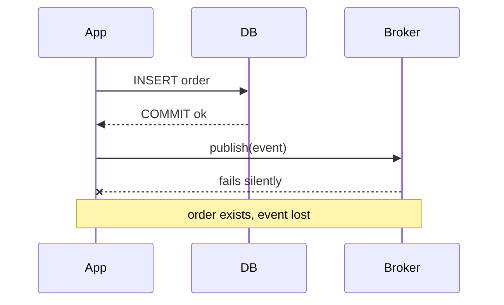
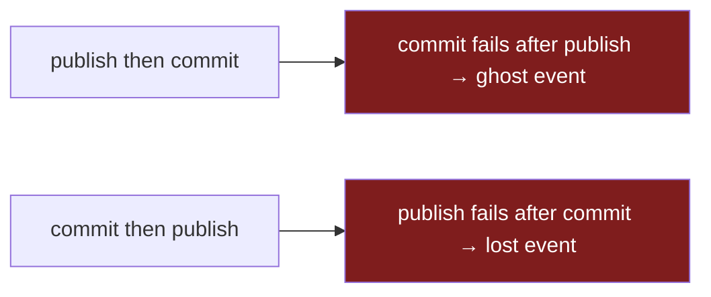
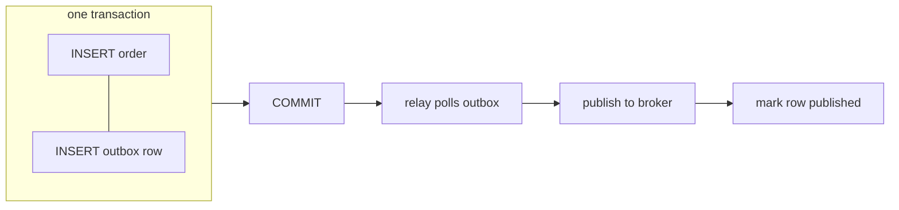

> **Part 1 of 2.** Build the outbox by hand. In [Part 2](/technical/streaming-the-outbox-with-cdc/), change-data-capture replaces the relay.

The first time it bit me, the symptom was a customer email that never arrived. The order was in the database — paid, confirmed, sitting right there. But the "order placed" event was never published, so the service that sends the email never woke up. No exception, no failed request, no red line in any log. The code had done exactly what it was told.

| | |
|---|---|
| **Problem** | You write to the DB *and* publish to a broker in one operation. One eventually fails — silently. |
| **Why** | They're two separate systems with no shared transaction. Nothing makes both succeed together. |
| **Goal** | "Data saved" and "event published" become all-or-nothing — using only the DB we already trust. |



Here is what the code was told to do — and why it's a trap waiting to spring:

```go
tx, _ := db.Begin()
tx.Exec("INSERT INTO orders ...")
tx.Commit()                          // succeeds
broker.Publish("orders.created", e)  // network blips, broker is mid-restart — lost
```

The commit and the publish are two independent operations against two independent systems. Most of the time both succeed and you never think about it. But "most of the time" is exactly the property that makes this dangerous: it passes every test, ships to production, and fails weeks later under a broker restart or a network blip — as data that exists with no event to announce it. The worst kind of bug is the one with no error attached.

## The naive fix doesn't work

The instinct is to move the publish *inside* the transaction so they "succeed together." It feels safer. It is not.



**No ordering of these two statements is atomic, because the broker has no idea your transaction exists.** Publish-then-commit and the commit fails? You've announced an order that doesn't exist — now a downstream service charges a card or reserves stock for a phantom. Commit-then-publish and the publish fails? You're back to the original silent-loss bug. There is no third ordering. You're trying to make two systems agree without anything that can hold them to the agreement.

## The real problem

What you actually want is one transaction spanning the database *and* the broker — commit both or neither. That's distributed atomicity, and the textbook tool is two-phase commit (2PC): a coordinator asks every participant to "prepare," and only if all vote yes does it tell them to commit. It's worth being precise about why I don't reach for it here:

- **The broker usually can't play.** Kafka transactions are for atomic writes *within* Kafka, not a cross-system prepare/commit handshake with your Postgres. The two simply don't share a transaction manager.
- **It couples your availability to your least reliable participant.** Under 2PC your write path is only as available as the slowest, flakiest member. If the broker is having a bad afternoon, your *database writes* now block on it. You've taken your most reliable system and taught it to fail whenever your least reliable one does.
- **The coordinator is a new failure mode you now operate.** A coordinator that dies after "prepare" but before "commit" leaves participants holding locks, waiting. Now you own a coordinator, its persistence, and its recovery story.

So the real problem isn't "how do I do 2PC well." It's sharper than that: **how do I get atomicity using only the one transactional system I already trust — the database — and stop pretending the broker can participate at all.**

## The outbox: one commit, one source of truth

Write the event into the *same database*, in the *same transaction*, as the data change. A separate process reads those rows later and publishes them. The database commit becomes the single fact that has to be true; publishing is downstream of a row that already exists.



```go
tx, _ := db.Begin()
tx.Exec("INSERT INTO orders ...")
tx.Exec("INSERT INTO outbox (topic, payload) VALUES ($1, $2)", "orders.created", event)
tx.Commit() // both rows land, or neither does
```

The whole trick lives in that single `Commit()`. The event and the data are now governed by **one** atomic operation: if the order saves, the event row exists; if the transaction rolls back, the event was never written. There is no window where one is true and the other isn't. The relay can then crash, get redeployed, run behind — and lose nothing, because unpublished rows simply sit in the table until something drains them. You've converted an unsolvable two-system problem into an ordinary one-table read, which is a problem databases are extremely good at.

## The trade-off

The outbox isn't free. The bill comes in three parts, and naming them is the point — a pattern you can't critique is one you don't understand yet.

| Cost | Why | What it forces |
|---|---|---|
| **At-least-once delivery** | Relay may publish, then crash *before* marking the row done → re-sends on restart | Consumers **must be idempotent** |
| **Ordering is now your job** | A multi-worker relay reorders events under concurrency | Single writer per key — which caps throughput |
| **Latency + a moving part** | Events ship on the poll interval, not instantly; the relay is a process to run | Monitor outbox backlog; alert when it grows |

The first one matters most, so it's worth dwelling on. At-least-once isn't a flaw I'm tolerating — it's the *correct* default. The alternative, marking the row published *before* you publish, gives you at-most-once, which silently drops events: the exact bug we started with, reintroduced. So at-least-once is right, but it pushes a hard requirement downstream: **every consumer must be idempotent.** If a duplicate "order placed" charges a card twice, you haven't solved your problem — you've moved it into someone else's service. (That's its own post: idempotency keys and dedup windows.)

I still reach for the outbox almost every time, because of *which* failure each side leaves you with. Without it: committed data, lost event, no error — a bug that surfaces as a confused customer days later, with nothing in the logs to trace. With it: an occasional duplicate, which a dedup key turns into a no-op. **I will take a duplicate I can dedupe over a silent drop I can't even detect, every single time.**

That relay I have to write, run, and watch is the one cost I'd most like to delete. And it turns out I can: the database already keeps a perfect, ordered log of every commit — the write-ahead log. **[Part 2](/technical/streaming-the-outbox-with-cdc/) reads that log directly with Debezium, and the hand-written relay disappears** — in exchange for a different, sharper set of trade-offs.
