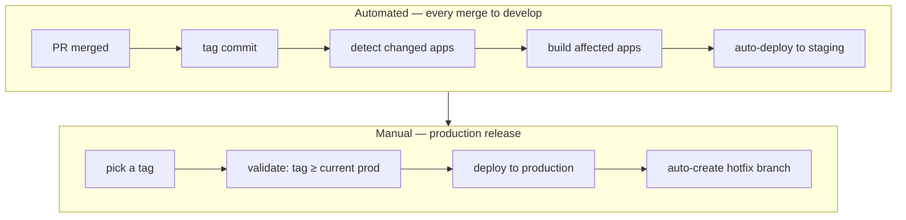
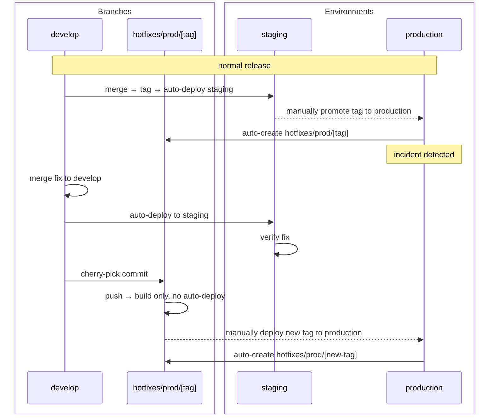

Long-lived branches defer integration risk. By the time an 800-line branch merges, the author has lost context on both their own change and everything that moved under them on `develop`. The fix is not stricter branch hygiene — it's separating integration from release so there's no reason to hold a branch open.

**The core invariant: `develop` is always deployable. Whether something is released is controlled by flags, not branch state.**

| | |
|---|---|
| **Problem** | Integration deferred to merge time means conflicts, stale context, and large blast radius per deploy. |
| **Mechanism** | Short-lived branches, continuous integration to `develop`, feature flags for release control. |
| **Goal** | Every merge to `develop` is tested, integrated, and safe to deploy. Release is a flag flip, not a deploy. |

## Branch strategy

One long-lived branch: `develop`. Engineers branch off `develop`, work in short-lived branches — target hours to two days, never weeks — and merge back via PR. The PR is a review, not a staging environment.

Branch naming is irrelevant to the model. What matters is that nothing accumulates more than a few days of divergence from `develop`. A branch that's open for a week is already carrying integration debt — it will find out about conflicts at merge time, and the author has lost the mental context to resolve them cleanly.

## CI pipeline on merge

Every merge to `develop` triggers a pipeline with these steps, in order:

1. **Auto-tag the commit** — deterministic version string from the commit timestamp or sequence. This is the artifact identifier for the rest of the pipeline.
2. **Detect changed apps** — diff against the previous tag; only apps with changed files get rebuilt. In a monorepo with 10 services, a PR touching one service rebuilds one service.
3. **Build affected apps** — produces the artifacts tagged in step 1.
4. **Auto-deploy to staging** — staging always reflects the latest `develop`. No manual trigger, no coordination, no "did you deploy yet?"



The production promotion is always manual — someone picks a tag from `develop` and triggers the deployment workflow. This is the deliberate gate between "integrated" and "released."

## Timestamp gate

The deployment workflow rejects any tag older than what's currently running in production. The check is simple: `tag_timestamp >= current_prod_tag_timestamp`. If it fails, the deploy aborts before touching infrastructure.

This prevents the most common accidental rollback: someone picks a tag from three weeks ago for some reason, deploys it, and overwrites two weeks of production releases. The gate makes that physically impossible without an explicit override.

The gate also enforces forward-only promotion. Rollbacks, when needed, are done by reverting in `develop` and deploying the new commit — not by picking an old tag. This keeps the rollback visible in the commit history instead of being a silent deploy-artifact operation.

## Feature flags

Feature flags are the mechanism that makes short branches viable for incomplete features. The pattern is straightforward:

```typescript
if (flags.isEnabled('new-checkout-flow', userId)) {
  return newCheckoutFlow(cart);
}
return legacyCheckoutFlow(cart);
```

The flag is the release control, not the branch. An engineer can merge a half-built checkout flow on day one, keep merging incremental changes daily, and users see nothing until the flag is flipped. No branch accumulates. No conflict builds up.

**Flag discipline has three rules:**

1. **Name flags for the feature, not the implementation.** `new-checkout-flow` not `use-stripe-v3`. The flag guards a user-facing behavior, and the name should match what product controls.
2. **Create a cleanup ticket at flag creation.** Flags are temporary by definition. A flag that shipped 6 months ago and is at 100% rollout is dead code with extra steps. The cleanup is trivial if you do it within a sprint of full rollout; it's archaeology if you do it a year later.
3. **Default to off.** A flag that defaults to on is an anti-flag — incomplete code is now the default path for anyone who hasn't explicitly opted into the flag infrastructure.

Flag accumulation is the main failure mode of this model. Teams adopt the flag discipline but skip the cleanup, and after a year the codebase has 40 flags, half of which are fully shipped and no longer guarded. Treat flag count as a metric worth monitoring.

## Hotfix flow

Every production deployment auto-creates a hotfix branch pointing at exactly the deployed tag. When an incident hits, the entry point already exists — no scramble to figure out what's running in production.

**The fix always starts in `develop`, never the hotfix branch.** This is the invariant that cannot reverse under pressure.



The order that must not reverse under pressure: `develop` → verify on staging → cherry-pick to hotfix branch → deploy to production.

If the fix goes to the hotfix branch first — the instinct under an incident — it exists only in the hotfix branch. When the next release from `develop` is promoted, the fix is overwritten. This is the most common hotfix failure mode, and it's hard to catch because the system looks correct immediately after the incident.

**Hotfix branch structure for multiple environments:**

If there's a preprod environment between staging and production, the hotfix chain extends:

1. Fix lands in `develop` → auto-deploys to staging → verified
2. Cherry-pick to `hotfixes/preprod/[tag]` → auto-deploys to preprod → verified
3. Cherry-pick to `hotfixes/prod/[tag]` → manual trigger to production

The preprod hotfix branch is created automatically when preprod is deployed, same as the prod one.

## Why not release branches

The alternative is cutting a `release/2.4` branch at a milestone, stabilizing it, deploying it. The workflow looks structured. In practice it creates two codebases running in parallel.

A fix that goes into `release/2.4` may or may not get backported to `develop`. When the team is focused on the incident, backport is an afterthought. The bug reappears in `release/2.5` six weeks later. The release branch wasn't protecting production — it was hiding integration debt and splitting the fix surface across two places.

Tags on `develop` are immutable deploy artifacts that do the same job. The difference: there's one codebase, one fix surface, and the tag makes no claim about ongoing stability. It's just a pointer to a known-good commit.

## Cost table

| Benefit | Cost | Failure mode |
|---|---|---|
| Integration risk surfaces at merge time, not release time | Every merge must pass CI | Flaky tests slow everyone down; teams start ignoring red builds |
| Staging always reflects latest `develop` | Feature flags accumulate | Old flags never get cleaned up; dead code with guards |
| Production promotions are explicit tag choices | Timestamp gate must be maintained | Gate drift lets old tags through |
| Hotfix path is pre-created | Fix must land in `develop` before production | Under pressure, order reverses — fix goes to production first and gets lost |

The non-negotiable dependency is CI reliability. A 40-minute flaky test suite in this model is worse than in any other — it's the gate every engineer hits multiple times a day. One engineer who starts bypassing CI because "the test is flaky anyway" breaks the model for everyone. Fix the test; don't route around it.

## The practical starting point

The smallest increment that demonstrates the model: take one feature currently on a long-lived branch, break it into the smallest mergeable piece, put the incomplete surface behind a flag, and merge. Track how long the next PR for that feature takes to merge and review. The diff size and conflict surface will both be smaller. That observation is more persuasive than this document.
