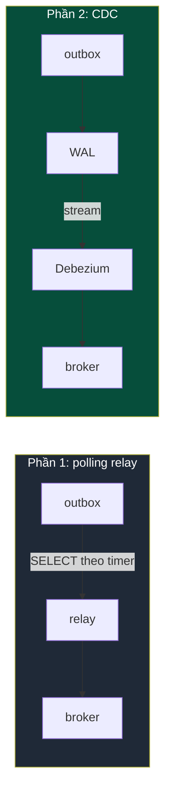
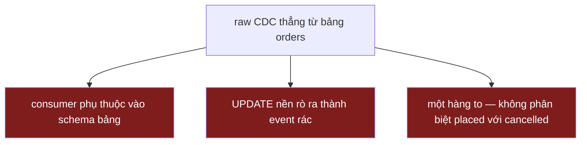
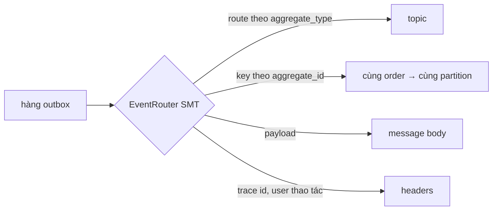

> **Phần 2 của 2.** [Phần 1](/vi/technical/van-de-dual-write/) đã dựng một outbox với polling relay. Giờ ta xoá relay.

Polling relay ở Phần 1 chạy được, nhưng nó làm việc thừa. Tôi hỏi database "có gì mới không?" theo timer, trong khi database đã biết câu trả lời ngay lúc hàng đó commit. Mỗi commit được ghi nối vào **write-ahead log**: bản ghi có thứ tự, bền vững của mọi thay đổi, đúng cái log Postgres dùng cho replication và crash recovery. Relay của tôi tự dựng lại — chậm hơn, thô hơn — cái log database đã giữ sẵn hoàn hảo.

| | |
|---|---|
| **Vấn đề** | Outbox ở Phần 1 cần một polling relay — một tiến trình phải viết, chạy và theo dõi. |
| **Vì sao** | Polling tự dựng lại theo timer một cái log mà Postgres *đã* giữ sẵn hoàn hảo: write-ahead log (WAL). |
| **Mục tiêu** | Publish thẳng từ WAL và xoá relay — mà không để lộ schema bảng cho consumer. |



Change-data-capture đọc thẳng cái log đó. Debezium kết nối như một logical replication client — đúng interface mà một Postgres read-replica dùng — đọc WAL và phát ra message cho mỗi thay đổi đã commit. Không còn polling loop, không còn tiến trình relay, và latency giảm từ "poll interval" xuống "WAL stream nhanh tới đâu", tức gần như real time.

## Đừng trỏ CDC vào bảng nghiệp vụ

Cám dỗ đầu tiên là xoá luôn bảng outbox. Giữ làm gì? Cứ stream thay đổi thẳng từ bảng `orders` — thay đổi của hàng *chính là* event. Đây cùng loại sai lầm với "publish bên trong transaction" ở Phần 1: gộp hai thứ trông giống nhau nhưng khác nhau.



Raw CDC từ bảng nghiệp vụ publish bất cứ gì xảy ra với hàng đó, không biết ý bạn là gì:

- **Schema coupling.** Mọi consumer giờ phụ thuộc vào layout vật lý của bảng. Đổi tên column, tách bảng, thêm NOT NULL — bạn làm hỏng mọi downstream service cùng lúc. Schema lưu trữ của bạn chưa bao giờ được thiết kế để làm public API, và ngay khi nó trở thành public API thì bạn không refactor được nữa.
- **Event bạn không hề định phát ra.** Job chạy đêm chạm vào `updated_at`, một đợt backfill dữ liệu, một lần sửa tay trong psql — tất cả stream ra thành "event". Consumer không phân biệt được một thay đổi trạng thái thật với một lần ghi vô tình.
- **Không kiểm soát được hình dạng hay ý nghĩa.** Một hàng `orders` thành một change record to với before/after image. Nhưng "order placed" và "order cancelled" là hai event khác nhau, khác consumer, khác payload. Một raw row không phân biệt được chúng.

Bài học: **CDC cho bạn một transport tin cậy, nhưng transport không phải là contract.** Tôi vẫn muốn tự quyết định, tường minh và bằng tay, cái gì được tính là domain event và nó có hình dạng gì. Nên bảng outbox vẫn ở lại — nó chưa bao giờ là phần tôi muốn bỏ. Cái tôi muốn bỏ là *relay*.

## Giữ outbox, stream nó bằng EventRouter

**Schema outbox được thiết kế để route, không chỉ để lưu** — mỗi column ứng với một phần của message phát ra, nên công cụ change-capture có thể route và định hình từng hàng:

```sql
CREATE TABLE outbox_events (
  id             BIGINT GENERATED ALWAYS AS IDENTITY PRIMARY KEY,
  aggregate_type TEXT NOT NULL,  -- "orders"       → route tới topic
  aggregate_id   TEXT NOT NULL,  -- "ord_123"      → thành message key
  event_type     TEXT NOT NULL,  -- "order.placed"
  payload        JSONB NOT NULL,
  created_at     TIMESTAMPTZ NOT NULL DEFAULT now()
);
```

Write path giống hệt Phần 1: một transaction, hai insert. Chỉ phần *reader* thay đổi. Thay cho relay của tôi, Debezium connector đọc WAL và chạy **outbox EventRouter** — một transform có sẵn, biết bảng này là outbox chứ không phải bảng nghiệp vụ, và biến mỗi hàng được insert thành một message được địa chỉ hoá đúng.



Nó làm những gì relay của tôi làm, và nhiều hơn, theo kiểu declarative. Nó route mỗi hàng tới một topic theo `aggregate_type`, đặt message key từ `aggregate_id` để mọi event của một order rơi vào cùng một partition (đây là cách giữ thứ tự theo từng order trong Kafka), và gửi `payload` làm body. Quan trọng: **chỉ insert vào chính bảng này mới thành event** — nên vấn đề schema-coupling và event vô tình của cách làm ngây thơ biến mất ngay từ thiết kế. Consumer thấy payload tôi cố ý định hình, không bao giờ thấy schema vật lý của tôi.

Một chi tiết đáng học theo: đẩy các field thuộc request-context — trace ID, user thao tác — vào message **header** thay vì payload body. Nhờ vậy consumer ghép được một distributed trace qua bước async mà không để các field vận hành đó lọt vào contract của domain event. Giữ event nói về domain; giữ phần plumbing trong header.

## Cái giá phải trả

CDC xoá relay, nhưng không xoá chi phí — nó đổi một vấn đề tôi hiểu rõ lấy vài vấn đề khác.

| Chi phí | Hậu quả |
|---|---|
| **Replication slot = rủi ro đầy disk** | Debezium chết → Postgres giữ lại WAL → disk đầy → **cả DB sập** |
| **DB ít traffic làm slot đứng** | Slot chỉ tiến khi WAL dịch chuyển; một DB ít ghi ghim nó hàng giờ |
| **`snapshot.mode: never`** | Không backfill ở lần khởi động đầu — cấu hình sai là bỏ sót event trong im lặng |
| **Giờ bạn phải vận hành Kafka Connect** | Một cluster, một connector, một slot + publication phải provision, một dashboard mới |
| **Vẫn là at-least-once** | Gửi lại sau khi restart → consumer **phải idempotent** (như Phần 1) |

Chỉ một chi phí thực sự nguy hiểm: **replication slot**. Logical slot khiến Postgres giữ lại WAL cho tới khi consumer đọc qua điểm đó. Nếu Debezium chết mà không ai để ý, WAL dồn lại, disk đầy và **cả database sập** — không chỉ event pipeline. Relay viết tay tệ nhất chỉ tụt lại phía sau; slot thì kéo sập cả DB, nên monitor slot-lag là bắt buộc từ ngày đầu. Hai biến thể của cùng rủi ro: một database ít ghi để slot ghim ở vị trí cũ hàng giờ — khắc phục bằng **heartbeat**, cho Debezium định kỳ ghi một hàng nhỏ để slot tiến lên; và `snapshot.mode: never` không backfill, nên slot phải tồn tại *trước* lần ghi outbox đầu tiên, nếu không event đầu trôi mất.

Phần còn lại là chi phí vận hành. Bạn giờ chạy thêm Kafka Connect — một cluster, connector, slot/publication (provision bằng Terraform), dashboard — đáng công với nhiều stream nhưng thừa thãi cho một. Và vẫn là at-least-once: consumer vẫn phải idempotent, y như Phần 1.

Tôi có làm lại không? Với một stream lưu lượng thấp, polling relay ở Phần 1 thực sự ổn và tôi dừng ở đó — ít thứ để hỏng, không slot phải trông. Tôi chọn CDC khi relay không còn là phần đơn giản: nhiều bảng trải trên nhiều service, latency thực sự ảnh hưởng tới người dùng, hoặc một polling loop mà chính tải của nó lên database đã thành vấn đề. Ở quy mô đó, xoá N relay viết tay để đọc thẳng cái log database đã giữ sẵn là lựa chọn tốt hơn — **miễn là có người đang trông cái slot đó.**
