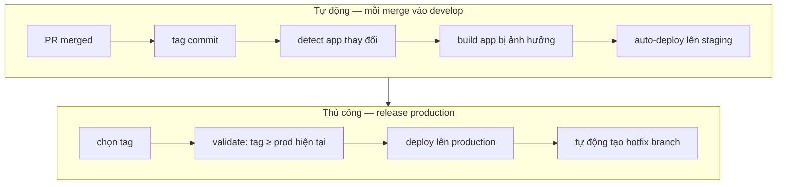
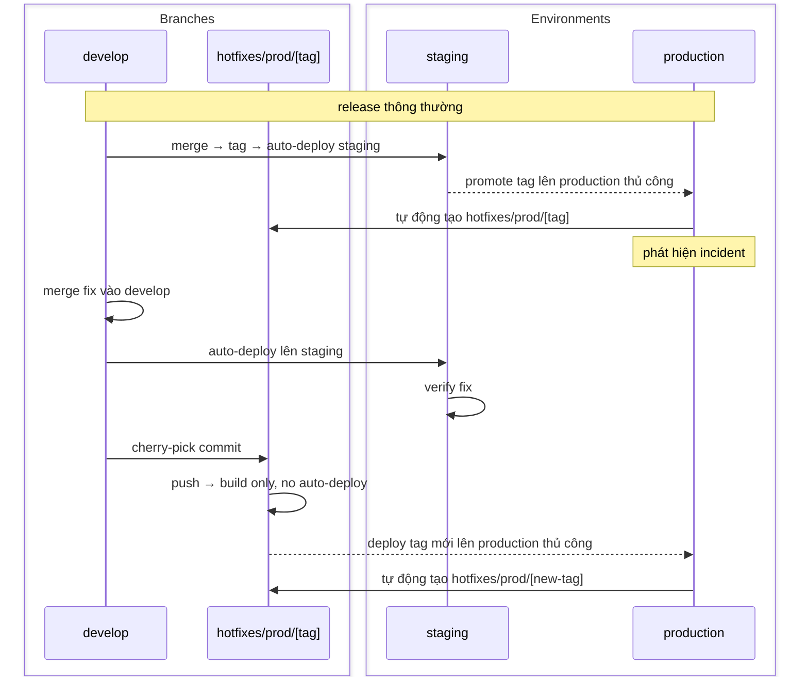

Branch sống lâu trì hoãn rủi ro integration. Đến khi branch 800 dòng merge, tác giả đã mất context về cả thay đổi của mình lẫn mọi thứ dịch chuyển trên `develop`. Fix không phải là branch hygiene nghiêm hơn — mà là tách integration khỏi release để không còn lý do giữ branch mở.

**Invariant cốt lõi: `develop` luôn có thể deploy. Release được kiểm soát bởi flag, không phải branch state.**

| | |
|---|---|
| **Vấn đề** | Integration bị trì hoãn đến lúc merge nghĩa là conflict, context cũ, và blast radius lớn mỗi deploy. |
| **Cơ chế** | Branch ngắn, integrate liên tục vào `develop`, feature flag kiểm soát release. |
| **Mục tiêu** | Mỗi merge vào `develop` đã test, đã integrate, safe để deploy. Release là flip flag, không phải deploy. |

## Branch strategy

Một branch sống lâu duy nhất: `develop`. Engineer tạo branch từ `develop`, làm trong branch ngắn — target từ vài giờ đến hai ngày, không bao giờ tính tuần — rồi merge lại qua PR. PR là review, không phải staging environment.

Tên branch không quan trọng trong model này. Điều quan trọng là không có gì tích lũy quá vài ngày divergence so với `develop`. Branch mở một tuần đã mang integration debt — conflict sẽ lộ ra khi merge, và tác giả đã mất context để giải quyết.

## CI pipeline khi merge

Mỗi merge vào `develop` trigger pipeline theo thứ tự:

1. **Auto-tag commit** — chuỗi version xác định từ commit timestamp hoặc sequence. Đây là artifact identifier cho toàn bộ pipeline.
2. **Detect app thay đổi** — diff so với tag trước; chỉ app có file thay đổi mới được rebuild. Monorepo 10 service, PR chỉ chạm một service thì rebuild một service.
3. **Build app bị ảnh hưởng** — tạo artifact được tag ở bước 1.
4. **Auto-deploy lên staging** — staging luôn phản ánh `develop` mới nhất. Không cần trigger thủ công, không cần phối hợp.



Promotion lên production luôn thủ công — ai đó chọn tag từ `develop` và trigger deployment workflow. Đây là gate có chủ ý giữa "đã integrate" và "đã release".

## Timestamp gate

Deployment workflow reject bất kỳ tag nào cũ hơn version đang chạy trên production. Check đơn giản: `tag_timestamp >= current_prod_tag_timestamp`. Nếu fail, deploy abort trước khi chạm infrastructure.

Cơ chế này ngăn rollback vô ý phổ biến nhất: ai đó chọn tag từ ba tuần trước, deploy lên, và ghi đè hai tuần release production. Gate làm điều đó bất khả thi mà không cần override tường minh.

Gate cũng enforce forward-only promotion. Rollback, khi cần, được làm bằng cách revert trong `develop` và deploy commit mới — không phải chọn tag cũ. Rollback đó hiển thị trong commit history thay vì là thao tác deploy-artifact im lặng.

## Feature flags

Feature flag là cơ chế giúp branch ngắn khả thi với feature chưa hoàn thiện. Pattern đơn giản:

```typescript
if (flags.isEnabled('new-checkout-flow', userId)) {
  return newCheckoutFlow(cart);
}
return legacyCheckoutFlow(cart);
```

Flag là release control, không phải branch. Engineer có thể merge checkout flow mới xây được một nửa ngay ngày đầu, tiếp tục merge tăng dần mỗi ngày, và người dùng không thấy gì cho đến khi flag được bật. Không có branch tích lũy. Không có conflict xây dựng.

**Kỷ luật flag có ba quy tắc:**

1. **Đặt tên flag theo feature, không theo implementation.** `new-checkout-flow` không phải `use-stripe-v3`. Flag guard behavior người dùng thấy, tên phải khớp với thứ product kiểm soát.
2. **Tạo cleanup ticket ngay khi tạo flag.** Flag là tạm thời theo định nghĩa. Flag đã ship 6 tháng và ở 100% rollout là dead code với thêm bước. Cleanup trivial nếu làm trong một sprint sau full rollout; là archaeology nếu làm một năm sau.
3. **Default là tắt.** Flag default bật là anti-flag — code chưa hoàn thiện trở thành default path cho bất kỳ ai chưa vào flag infrastructure.

Flag accumulation là failure mode chính của model này. Team áp dụng kỷ luật flag nhưng skip cleanup, và sau một năm codebase có 40 flag, nửa số đó đã ship hoàn toàn và không còn được guard. Coi flag count là metric đáng theo dõi.

## Hotfix flow

Mỗi lần deploy production tự động tạo hotfix branch trỏ đúng vào tag đã deploy. Khi incident xảy ra, entry point đã sẵn sàng — không cần scramble để tìm xem production đang chạy gì.

**Fix luôn bắt đầu từ `develop`, không bao giờ từ hotfix branch.** Đây là invariant không được đảo ngược dưới áp lực.



Thứ tự không được đảo ngược dưới áp lực: `develop` → verify trên staging → cherry-pick vào hotfix branch → deploy lên production.

Nếu fix vào hotfix branch trước — bản năng khi incident — nó chỉ tồn tại trong hotfix branch. Khi release tiếp theo từ `develop` được promote, fix bị ghi đè. Đây là failure mode hotfix phổ biến nhất, và khó phát hiện vì hệ thống trông đúng ngay sau incident.

**Cấu trúc hotfix branch với nhiều môi trường:**

Nếu có môi trường preprod giữa staging và production, hotfix chain kéo dài:

1. Fix vào `develop` → auto-deploy lên staging → verify
2. Cherry-pick vào `hotfixes/preprod/[tag]` → auto-deploy lên preprod → verify
3. Cherry-pick vào `hotfixes/prod/[tag]` → trigger thủ công lên production

Hotfix branch preprod tự động tạo khi preprod được deploy, giống như prod.

## Tại sao không dùng release branch

Phương án thay thế là cắt branch `release/2.4` tại milestone, stabilize, deploy. Workflow trông có cấu trúc. Thực tế tạo ra hai codebase chạy song song.

Fix vào `release/2.4` có thể hoặc không được backport vào `develop`. Khi team đang tập trung vào incident, backport là afterthought. Bug tái xuất trong `release/2.5` sáu tuần sau. Release branch không bảo vệ production — nó che giấu integration debt và tách fix surface ra hai chỗ.

Tag trên `develop` là immutable deploy artifact làm cùng việc. Khác biệt: một codebase, một fix surface, và tag không claim gì về ongoing stability. Chỉ là con trỏ vào commit đã biết là tốt.

## Cost table

| Lợi ích | Chi phí | Failure mode |
|---|---|---|
| Rủi ro integration lộ khi merge, không phải release | Mỗi merge phải pass CI | Test flaky làm chậm mọi người; team bỏ qua build đỏ |
| Staging luôn phản ánh `develop` mới nhất | Feature flag tích lũy | Flag cũ không được dọn; dead code với guards |
| Production promotion là lựa chọn tag tường minh | Timestamp gate phải được maintain | Gate drift cho phép tag cũ qua |
| Hotfix path đã được tạo sẵn | Fix phải vào `develop` trước production | Dưới áp lực, thứ tự đảo ngược — fix vào production trước và mất đi |

Dependency không thể thiếu là CI reliability. Test suite flaky 40 phút trong model này tệ hơn bất cứ đâu — đây là cổng mỗi engineer phải đi qua nhiều lần mỗi ngày. Một engineer bắt đầu bypass CI vì "test đó flaky rồi" phá vỡ model cho cả team. Fix test; đừng route around nó.

## Điểm bắt đầu thực tế

Increment nhỏ nhất để chứng minh model: lấy feature đang trên branch sống lâu, chia thành phần nhỏ nhất có thể merge, đặt phần chưa xong sau flag, merge. Theo dõi PR tiếp theo cho feature đó mất bao lâu để merge và review. Diff size và conflict surface sẽ đều nhỏ hơn. Quan sát đó thuyết phục hơn tài liệu này.
