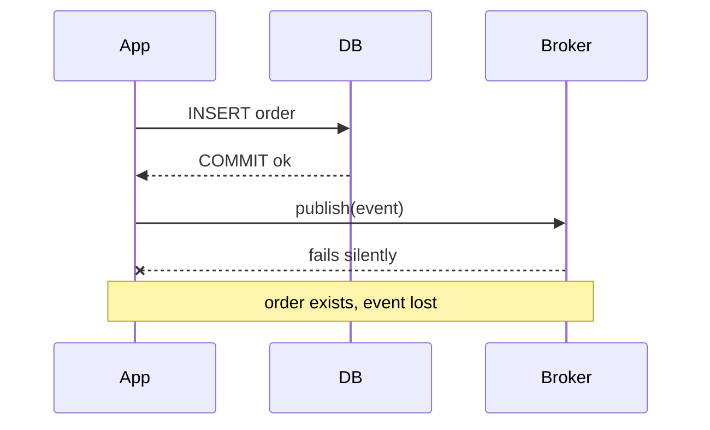
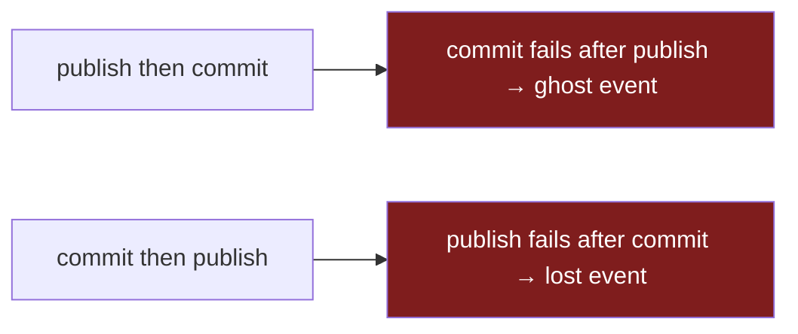
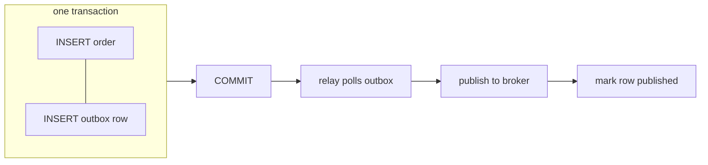

> **Phần 1 của 2.** Tự tay dựng outbox. Ở [Phần 2](/technical/streaming-the-outbox-with-cdc/), change-data-capture sẽ thay thế cho relay.

Lần đầu tiên nó cắn tôi, triệu chứng là một email khách hàng không bao giờ tới. Đơn hàng đã nằm trong database — đã thanh toán, đã xác nhận, sờ sờ ngay đó. Nhưng sự kiện "order placed" chưa bao giờ được publish, nên service gửi email chẳng bao giờ thức dậy. Không exception, không request thất bại, không một dòng đỏ nào trong log. Code đã làm đúng y những gì nó được bảo.

| | |
|---|---|
| **Vấn đề** | Bạn ghi vào DB *và* publish lên broker trong một thao tác. Sớm muộn một cái thất bại — trong im lặng. |
| **Vì sao** | Chúng là hai hệ thống tách biệt, không chung transaction. Không có gì bắt cả hai cùng thành công. |
| **Mục tiêu** | "Dữ liệu đã lưu" và "sự kiện đã publish" trở thành all-or-nothing — chỉ dùng đúng cái DB ta vốn đã tin tưởng. |



Đây là những gì code được bảo phải làm — và vì sao nó là cái bẫy chực chờ sập:

```go
tx, _ := db.Begin()
tx.Exec("INSERT INTO orders ...")
tx.Commit()                          // succeeds
broker.Publish("orders.created", e)  // network blips, broker is mid-restart — lost
```

Commit và publish là hai thao tác độc lập trên hai hệ thống độc lập. Phần lớn thời gian cả hai đều thành công và bạn chẳng bao giờ bận tâm. Nhưng "phần lớn thời gian" lại chính là cái tính chất khiến nó nguy hiểm: nó vượt qua mọi test, lên production, rồi thất bại vài tuần sau dưới một lần broker restart hay một cú network blip — dưới dạng dữ liệu tồn tại mà không có sự kiện nào công bố nó. Loại bug tệ nhất là loại không kèm theo lỗi nào cả.

## Cách sửa ngây thơ không hiệu quả

Bản năng mách bảo ta chuyển publish vào *bên trong* transaction để chúng "cùng thành công." Nghe có vẻ an toàn hơn. Không hề.



**Không thứ tự nào của hai câu lệnh này là atomic, bởi broker chẳng hề biết transaction của bạn tồn tại.** Publish-rồi-commit và commit thất bại? Bạn vừa công bố một đơn hàng không tồn tại — giờ một service phía dưới trừ tiền thẻ hoặc giữ hàng cho một bóng ma. Commit-rồi-publish và publish thất bại? Bạn quay về đúng cái bug mất mát trong im lặng ban đầu. Không có thứ tự thứ ba. Bạn đang cố bắt hai hệ thống đồng thuận mà không có gì ràng buộc chúng vào thỏa thuận đó.

## Vấn đề thực sự

Cái bạn thực sự muốn là một transaction trải trên cả database *và* broker — commit cả hai hoặc không cái nào. Đó là distributed atomicity, và công cụ sách giáo khoa là two-phase commit (2PC): một coordinator hỏi mọi participant "prepare," và chỉ khi tất cả bỏ phiếu "có" nó mới bảo chúng commit. Cần nói rõ vì sao tôi không dùng nó ở đây:

- **Broker thường không thể tham gia.** Kafka transactions là để ghi atomic *bên trong* Kafka, không phải cái bắt tay prepare/commit xuyên hệ thống với Postgres của bạn. Hai bên đơn giản là không chung transaction manager.
- **Nó trói availability của bạn vào participant kém tin cậy nhất.** Dưới 2PC, write path của bạn chỉ "sống" được bằng thành viên chậm nhất, dễ vỡ nhất. Nếu broker đang có một buổi chiều tồi tệ, thì *các thao tác ghi database* của bạn giờ bị block vì nó. Bạn vừa lấy hệ thống tin cậy nhất của mình và dạy nó thất bại mỗi khi cái kém tin cậy nhất thất bại.
- **Coordinator là một failure mode mới mà giờ bạn phải vận hành.** Một coordinator chết sau "prepare" nhưng trước "commit" để các participant ôm lock, chờ đợi. Giờ bạn sở hữu một coordinator, phần lưu trữ của nó, và câu chuyện recovery của nó.

Vậy vấn đề thực sự không phải "làm sao để 2PC cho tốt." Nó sắc hơn thế: **làm sao đạt được atomicity mà chỉ dùng đúng một hệ thống transactional ta đã tin tưởng — database — và thôi giả vờ rằng broker có thể tham gia.**

## Outbox: một commit, một nguồn sự thật

Ghi sự kiện vào *cùng database đó*, trong *cùng transaction đó*, với thay đổi dữ liệu. Một tiến trình riêng đọc các hàng đó về sau và publish chúng. Cú commit database trở thành sự thật duy nhất phải đúng; việc publish nằm phía sau một hàng vốn đã tồn tại.



```go
tx, _ := db.Begin()
tx.Exec("INSERT INTO orders ...")
tx.Exec("INSERT INTO outbox (topic, payload) VALUES ($1, $2)", "orders.created", event)
tx.Commit() // both rows land, or neither does
```

Toàn bộ mẹo nằm trong đúng một `Commit()` đó. Sự kiện và dữ liệu giờ được cai quản bởi **một** thao tác atomic: nếu đơn hàng được lưu, hàng sự kiện tồn tại; nếu transaction rollback, sự kiện chưa bao giờ được ghi. Không có khoảng trống nào mà cái này đúng còn cái kia sai. Relay sau đó có thể crash, được redeploy, chạy trễ — và không mất gì, bởi các hàng chưa publish cứ nằm yên trong bảng cho tới khi có thứ gì đó rút chúng ra. Bạn vừa biến một vấn đề hai-hệ-thống không giải được thành một thao tác đọc một-bảng bình thường, mà đọc bảng là thứ database cực kỳ giỏi.

## Cái giá phải trả

Outbox không miễn phí. Hóa đơn gồm ba phần, và gọi tên chúng ra mới là điểm mấu chốt — một pattern bạn không thể phê phán là pattern bạn chưa thực sự hiểu.

| Cái giá | Vì sao | Buộc phải làm gì |
|---|---|---|
| **Giao ít nhất một lần (at-least-once)** | Relay có thể publish, rồi crash *trước khi* đánh dấu hàng xong → gửi lại khi khởi động lại | Consumer **phải idempotent** |
| **Thứ tự giờ là việc của bạn** | Relay nhiều worker đảo thứ tự sự kiện dưới tải đồng thời | Một writer duy nhất cho mỗi key — điều này giới hạn throughput |
| **Độ trễ + một bộ phận động** | Sự kiện đi theo nhịp poll, không tức thì; relay là một tiến trình phải chạy | Giám sát backlog outbox; cảnh báo khi nó phình to |

Cái đầu tiên quan trọng nhất, nên đáng để dừng lại. At-least-once không phải khiếm khuyết tôi đành chịu — nó là default *đúng*. Phương án thay thế, đánh dấu hàng đã publish *trước khi* bạn publish, cho bạn at-most-once, vốn âm thầm đánh rơi sự kiện: đúng cái bug ta khởi đầu, được tái sinh. Vậy at-least-once là đúng, nhưng nó đẩy một yêu cầu cứng xuống phía dưới: **mọi consumer phải idempotent.** Nếu một "order placed" trùng lặp trừ tiền thẻ hai lần, bạn chưa giải quyết vấn đề của mình — bạn đã chuyển nó sang service của người khác. (Đó là một bài viết riêng: idempotency key và cửa sổ dedup.)

Tôi vẫn chọn outbox gần như mọi lần, vì *loại* thất bại mà mỗi bên để lại. Không có nó: dữ liệu đã commit, sự kiện mất, không lỗi nào — một bug nổi lên dưới dạng một khách hàng bối rối vài ngày sau, chẳng có gì trong log để lần ra. Có nó: thi thoảng một bản trùng, mà một dedup key biến thành no-op. **Tôi sẽ chọn một bản trùng tôi dedupe được hơn là một cú mất âm thầm tôi thậm chí không phát hiện nổi, mọi lúc.**

Cái relay tôi phải viết, chạy và canh chừng là cái giá tôi muốn xóa nhất. Và hóa ra tôi xóa được: database vốn đã giữ một log hoàn hảo, có thứ tự của mọi commit — write-ahead log. **[Phần 2](/technical/streaming-the-outbox-with-cdc/) đọc thẳng log đó bằng Debezium, và cái relay viết tay biến mất** — đổi lại bằng một bộ trade-off khác, sắc bén hơn.
