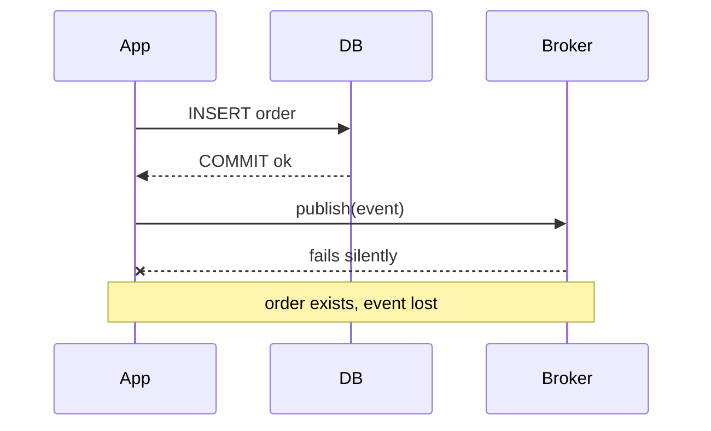
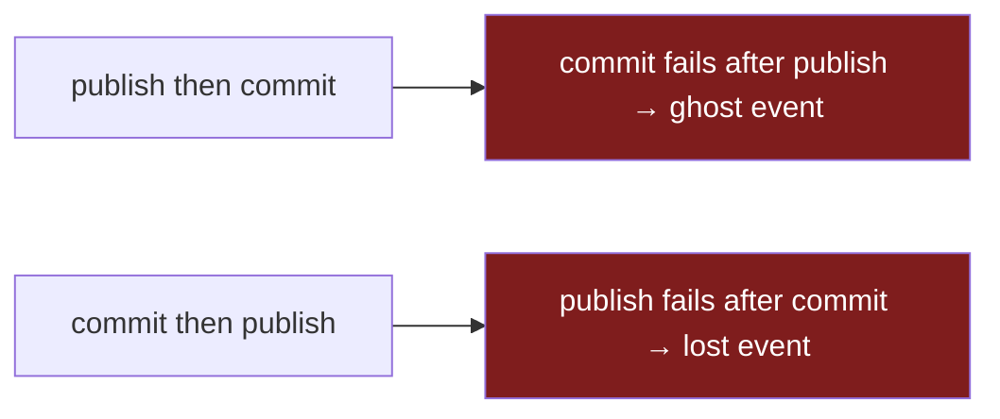
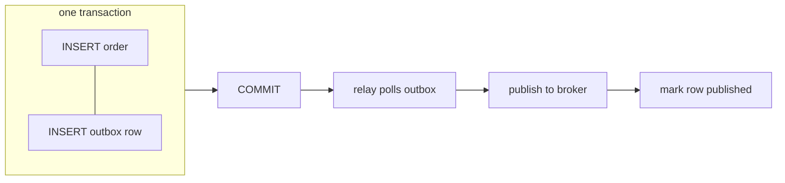

> **Phần 1 của 2.** Tự tay dựng outbox. Ở [Phần 2](/vi/technical/stream-outbox-bang-cdc/), change-data-capture sẽ thay thế cho relay.

Triệu chứng là email khách hàng không tới. Đơn hàng đã nằm trong database — đã thanh toán, xác nhận. Nhưng event "order placed" chưa được publish, nên service gửi email không chạy. Không exception, không request lỗi, không dòng nào trong log. Code chạy đúng những gì được lập trình.

| | |
|---|---|
| **Vấn đề** | Bạn ghi vào DB *và* publish lên broker trong một thao tác. Sớm muộn một cái thất bại — trong im lặng. |
| **Vì sao** | Chúng là hai hệ thống tách biệt, không chung transaction. Không có gì bắt cả hai cùng thành công. |
| **Mục tiêu** | "Dữ liệu đã lưu" và "sự kiện đã publish" trở thành all-or-nothing — chỉ dùng đúng cái DB ta vốn đã tin tưởng. |



Đây là đoạn code làm đúng yêu cầu:

```go
tx, _ := db.Begin()
tx.Exec("INSERT INTO orders ...")
tx.Commit()                          // succeeds
broker.Publish("orders.created", e)  // network blips, broker is mid-restart — lost
```

Commit và publish là hai thao tác độc lập trên hai hệ thống độc lập. Phần lớn thời gian cả hai đều thành công và bạn chẳng bao giờ bận tâm. Nhưng "phần lớn thời gian" chính là tính chất khiến nó nguy hiểm: nó vượt qua mọi test, lên production, vài tuần sau mới hỏng đúng lúc broker restart hay mạng chập chờn — dữ liệu tồn tại nhưng không event nào công bố. Bug khó phát hiện nhất là bug không kèm lỗi.

## Cách sửa ngây thơ không hiệu quả

Bản năng mách ta chuyển publish vào *bên trong* transaction để chúng "cùng thành công." Nghe an toàn hơn. Không hề.



**Không thứ tự nào của hai câu lệnh này là atomic, bởi broker chẳng hề biết transaction của bạn tồn tại.** Publish-rồi-commit và commit thất bại? Bạn vừa công bố một đơn hàng không tồn tại — giờ một service phía dưới trừ tiền thẻ hoặc giữ hàng cho một đơn không có thật. Commit-rồi-publish và publish thất bại? Bạn quay về đúng cái bug mất mát trong im lặng ban đầu. Không có thứ tự thứ ba. Bạn đang cố bắt hai hệ thống đồng thuận mà không có gì ràng buộc chúng vào thỏa thuận đó.

## Vấn đề thực sự

Cái bạn thực sự muốn là một transaction trải trên cả database *và* broker — commit cả hai hoặc không cái nào. Đó là distributed atomicity, và công cụ sách giáo khoa là two-phase commit (2PC): một coordinator hỏi mọi participant "prepare," và chỉ khi tất cả bỏ phiếu "có" nó mới bảo chúng commit. Cần nói rõ vì sao tôi không dùng nó ở đây:

- **Broker thường không thể tham gia.** Kafka transactions là để ghi atomic *bên trong* Kafka, không phải cái bắt tay prepare/commit xuyên hệ thống với Postgres của bạn. Hai bên đơn giản là không chung transaction manager.
- **Nó trói availability của bạn vào participant kém tin cậy nhất.** Dưới 2PC, write path của bạn chỉ "sống" được bằng thành viên chậm nhất, dễ vỡ nhất. Nếu broker đang trục trặc, thì *các thao tác ghi database* của bạn cũng bị nó chặn theo. Hệ thống tin cậy nhất của bạn giờ thất bại theo thành phần kém tin cậy nhất.
- **Coordinator là một failure mode mới mà giờ bạn phải vận hành.** Một coordinator chết sau "prepare" nhưng trước "commit" sẽ để các participant giữ lock và chờ vô tận. Giờ bạn phải tự vận hành một coordinator, lo phần lưu trữ và cả kịch bản recovery của nó.

Vậy vấn đề thực sự không phải "làm sao để 2PC cho tốt." Nó sắc hơn thế: **làm sao đạt được atomicity mà chỉ dùng đúng một hệ thống transactional ta đã tin tưởng — database — và thôi giả vờ rằng broker có thể tham gia.**

## Outbox: một commit, một nguồn sự thật

Ghi sự kiện vào *cùng database đó*, trong *cùng transaction đó*, với thay đổi dữ liệu. Một tiến trình riêng đọc các hàng đó về sau và publish chúng. Cú commit database trở thành sự thật duy nhất phải đúng; việc publish nằm phía sau một hàng vốn đã tồn tại.



```go
tx, _ := db.Begin()
tx.Exec("INSERT INTO orders ...")
tx.Exec("INSERT INTO outbox (topic, payload) VALUES ($1, $2)", "orders.created", event)
tx.Commit() // both rows land, or neither does
```

Toàn bộ mẹo nằm trong đúng một `Commit()` đó. Event và dữ liệu giờ nằm chung dưới **một** thao tác atomic: đơn hàng lưu thì hàng event tồn tại; transaction rollback thì event chưa từng được ghi. Không có khoảng trống nào mà cái này đúng còn cái kia sai. Relay sau đó có thể crash, redeploy, chạy trễ — không mất gì, vì các hàng chưa publish nằm yên trong bảng tới khi có thứ gì rút ra. Bạn biến một vấn đề hai-hệ-thống không giải được thành thao tác đọc một bảng — thứ database cực giỏi.

## Cái giá phải trả

Outbox không miễn phí. Cái giá gồm ba phần, và phải gọi tên được cả ba — một pattern bạn không phê phán được là pattern bạn chưa thực sự hiểu.

| Cái giá | Vì sao | Buộc phải làm gì |
|---|---|---|
| **Giao ít nhất một lần (at-least-once)** | Relay có thể publish, rồi crash *trước khi* đánh dấu hàng xong → gửi lại khi khởi động lại | Consumer **phải idempotent** |
| **Thứ tự giờ là việc của bạn** | Relay nhiều worker đảo thứ tự sự kiện dưới tải đồng thời | Một writer duy nhất cho mỗi key — điều này giới hạn throughput |
| **Độ trễ + một bộ phận động** | Sự kiện đi theo nhịp poll, không tức thì; relay là một tiến trình phải chạy | Giám sát backlog outbox; cảnh báo khi nó phình to |

Cái đầu quan trọng nhất. At-least-once không phải khiếm khuyết phải chấp nhận — nó là default *đúng*. Phương án ngược lại, đánh dấu hàng đã publish *trước khi* publish, cho bạn at-most-once: âm thầm đánh rơi sự kiện, đúng cái bug ban đầu. Nhưng at-least-once đẩy một yêu cầu cứng xuống dưới: **mọi consumer phải idempotent.** Nếu một "order placed" trùng trừ tiền thẻ hai lần, bạn không giải quyết vấn đề — bạn đẩy nó sang service khác. (Idempotency key và cửa sổ dedup là một bài riêng.)

Tôi vẫn chọn outbox gần như mọi lần, vì *loại* thất bại mỗi bên để lại. Không có nó: dữ liệu đã commit, sự kiện mất, không lỗi nào, không gì trong log để lần ra. Có nó: thi thoảng một bản trùng, mà dedup key biến thành no-op. **Tôi luôn chọn một bản trùng dedupe được hơn là một cú mất âm thầm không phát hiện nổi, mọi lần.**

Cái giá tôi muốn xóa nhất là relay — phải viết, chạy và canh chừng. Hóa ra xóa được: database vốn đã có sẵn log đầy đủ, theo đúng thứ tự mọi commit — write-ahead log. **[Phần 2](/vi/technical/stream-outbox-bang-cdc/) đọc thẳng log đó bằng Debezium, relay viết tay biến mất** — đổi lấy một bộ trade-off khác, gắt hơn.
